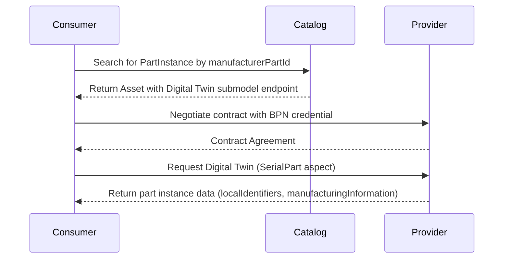
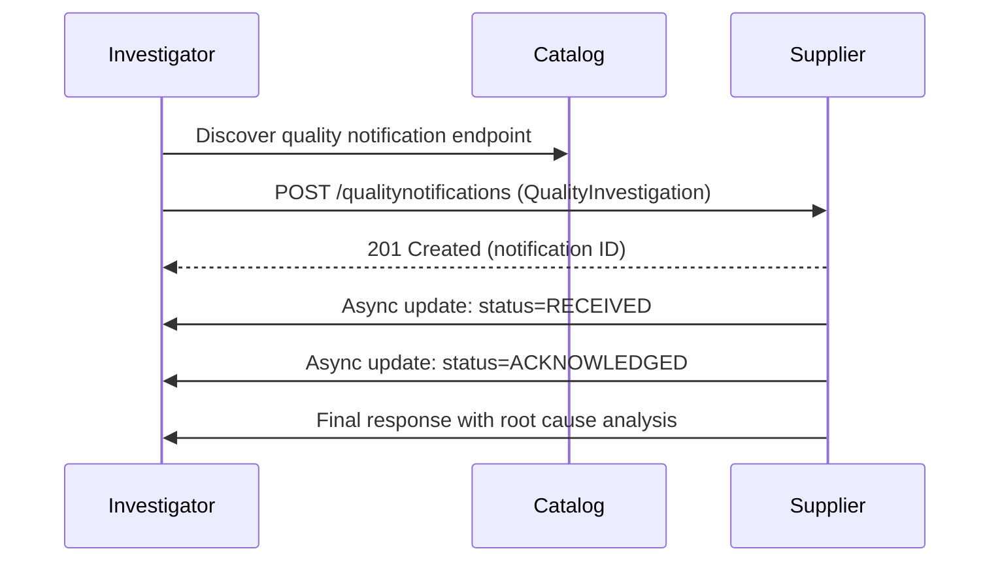
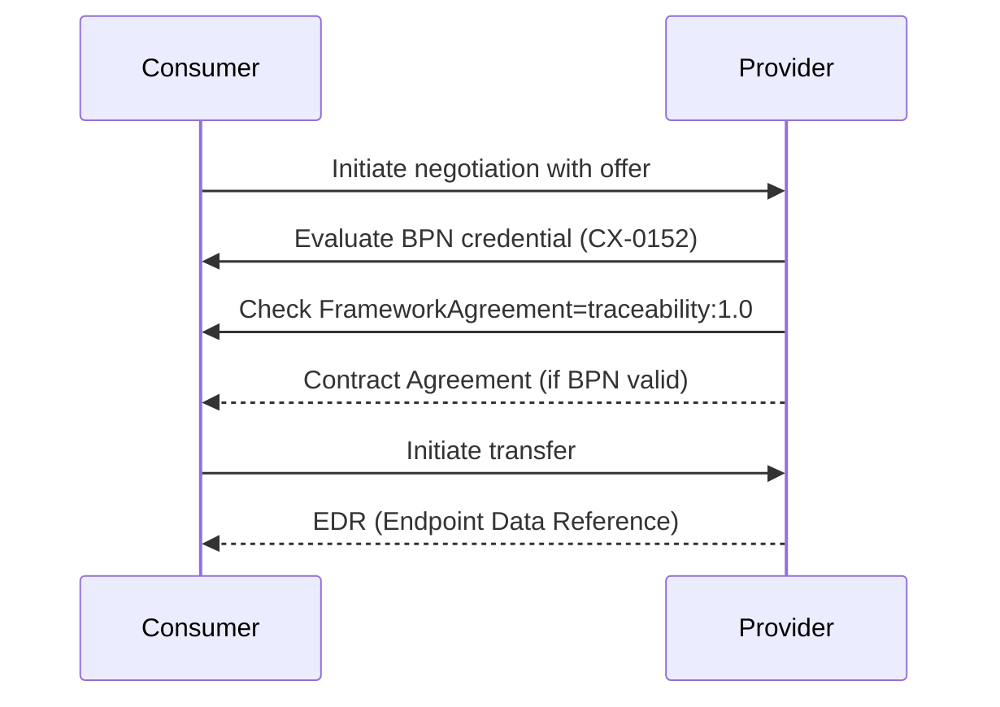
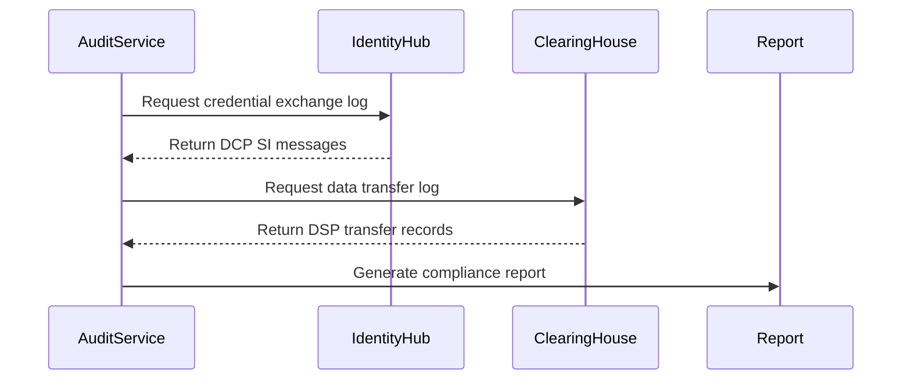

# [DOMAIN] Dataspace Specification

## Domain Placeholder
Replace `[DOMAIN]` with your domain (health, manufacturing, energy, etc.)

## Goals

What should this dataspace achieve?
- [ ] Enable secure data sharing across [DOMAIN]
- [ ] Ensure 100% compliance with [DOMAIN-SPECIFIC REGULATIONS]
- [ ] Support [DOMAIN-SPECIFIC USE CASES]

## Key Users

Who are the main stakeholders?
- **Data Providers:** [Define role in your domain]
- **Data Consumers:** [Define role in your domain]
- **Compliance Officers:** Audit and verify regulatory adherence
- **Operators:** Monitor and maintain the system

## Core Workflows

What are the main data flows?
1. [Workflow 1: Define data discovery/access pattern]
2. [Workflow 2: Define contract negotiation]
3. [Workflow 3: Define data transfer]
4. [Workflow 4: Define audit/compliance]

## Non-Functional Requirements

- Availability: 99.9% uptime
- Latency: <500ms p99
- Scalability: [Your target]
- Compliance: 100% [YOUR DOMAIN REGULATIONS]
- Security: Zero known vulnerabilities

---

# Example: Manufacturing/Automotive (Catena-X Pattern)

## Domain: Automotive Supply Chain Traceability

This example follows **Catena-X Industry Core** (CX-0151) patterns.

## Goals

- [ ] Enable secure part traceability across automotive supply chain
- [ ] Ensure 100% compliance with Catena-X standards (CX-0018, CX-0151, CX-0152)
- [ ] Support quality notification and PCF calculation use cases
- [ ] Enable digital twin lookups for part instances and part types

## Key Users

- **OEMs (Original Equipment Manufacturers):** Provide vehicle/part data, consume supplier data
- **Tier-1/2/3 Suppliers:** Provide part manufacturing data, consume downstream requirements
- **Traceability Coordinators:** Investigate quality issues across supply chain
- **Compliance Officers:** Audit Business Partner Numbers (BPN) and credential usage
- **Operators:** Monitor EDC connectors, IdentityHub, and federated catalog

## Core Workflows

### 1. Digital Twin Discovery (Industry Core Pattern)


**Industry Core Assets:**
- **PartInstance (SerialPart):** Individual serialized parts with unique IDs
- **PartType (Batch):** Part types without serialization (bulk materials)
- **PartSiteInformationAsBuilt:** Manufacturing site data

### 2. Quality Notification (Traceability KIT Pattern)


**Notification Types (CX-0151):**
- **QualityInvestigation:** Investigate potential quality issue
- **QualityAlert:** Alert about confirmed quality defect

### 3. Contract Negotiation with BPN Constraint


**Policy Constraints (CX-0152):**
- `cx-policy:Membership=active` - Active Catena-X membership
- `cx-policy:FrameworkAgreement=traceability:1.0` - Signed framework
- `cx-policy:UsagePurpose=cx.core.qualityNotification` - Purpose-based access
- `cx-policy:BusinessPartnerNumber` - BPN-based access control

### 4. Audit Trail (DCP Compliance)


## Data Models (Industry Core)

### PartInstance (SerialPart Aspect - CX-0151)
```json
{
  "localIdentifiers": [
    {"key": "manufacturerPartId", "value": "MPI-12345"},
    {"key": "partInstanceId", "value": "SN-98765"}
  ],
  "manufacturingInformation": {
    "date": "2024-01-15T10:30:00Z",
    "country": "DEU"
  },
  "catenaXId": "urn:uuid:580d3adf-1981-44a0-a214-13d6ceed9379",
  "partTypeInformation": {
    "manufacturerPartId": "MPI-12345",
    "nameAtManufacturer": "Transmission Gear"
  }
}
```

### QualityNotification (CX-0151)
```json
{
  "header": {
    "notificationId": "urn:uuid:1234-5678",
    "senderBPN": "BPNL000000000001",
    "recipientBPN": "BPNL000000000002",
    "severity": "CRITICAL",
    "status": "SENT",
    "targetDate": "2024-02-01T00:00:00Z"
  },
  "content": {
    "listOfAffectedItems": [
      {"catenaXId": "urn:uuid:580d3adf-1981-44a0-a214-13d6ceed9379"}
    ]
  }
}
```

## Non-Functional Requirements

- **Availability:** 99.9% uptime (measured at EDC connector)
- **Latency:** 
  - Digital Twin lookup: <500ms p99
  - Quality notification POST: <200ms p99
  - Async notification delivery: <5min p99
- **Scalability:** 
  - Support 10,000+ part instances per supplier
  - Handle 100+ concurrent quality notifications
- **Compliance:** 
  - 100% Catena-X standards (CX-0018, CX-0151, CX-0152)
  - 100% GDPR compliance for employee data
  - Verifiable audit trail for all data transfers
- **Security:** 
  - Zero known vulnerabilities (Snyk/Dependabot)
  - BPN credential validation on every contract
  - Mutual TLS (mTLS) for all EDC connections

## API Endpoints (See spec.yaml)

- `GET /catalog` - Federated catalog query (CX-0001)
- `POST /contractnegotiations` - DSP contract negotiation
- `POST /transferprocesses` - DSP transfer initiation
- `POST /qualitynotifications` - Quality notification endpoint (CX-0151)
- `GET /submodel/SerialPart` - Digital Twin submodel (AAS/SAMM)

## Testing Strategy

- **Unit Tests:** Policy evaluation functions (BPN, purpose, membership)
- **Integration Tests:** EDC-to-EDC communication with credentials
- **Contract Tests:** Quality notification API against CX-0151 spec
- **E2E Tests:** Full traceability flow (discover → negotiate → transfer → notify)
- **Compliance Tests:** CX-0152 policy constraint validation

---

# Additional Domain Examples

See `REAL-WORLD-DATASPACE-EXAMPLES.md` for patterns from:
- **Energy-Data-X:** Smart meter data, TSO/DSO coordination
- **Mobility Data Space (MDS):** Real-time traffic, parking data
- **EONA-X:** Multimodal travel, booking systems
- **Prometheus-X:** Learner credentials, consent management
