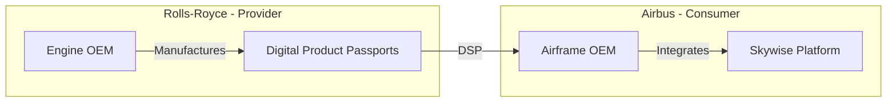
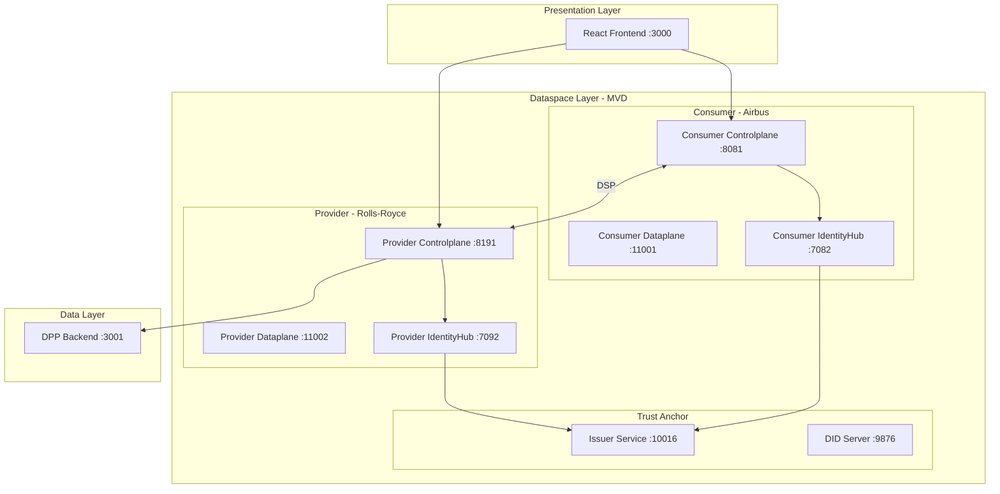
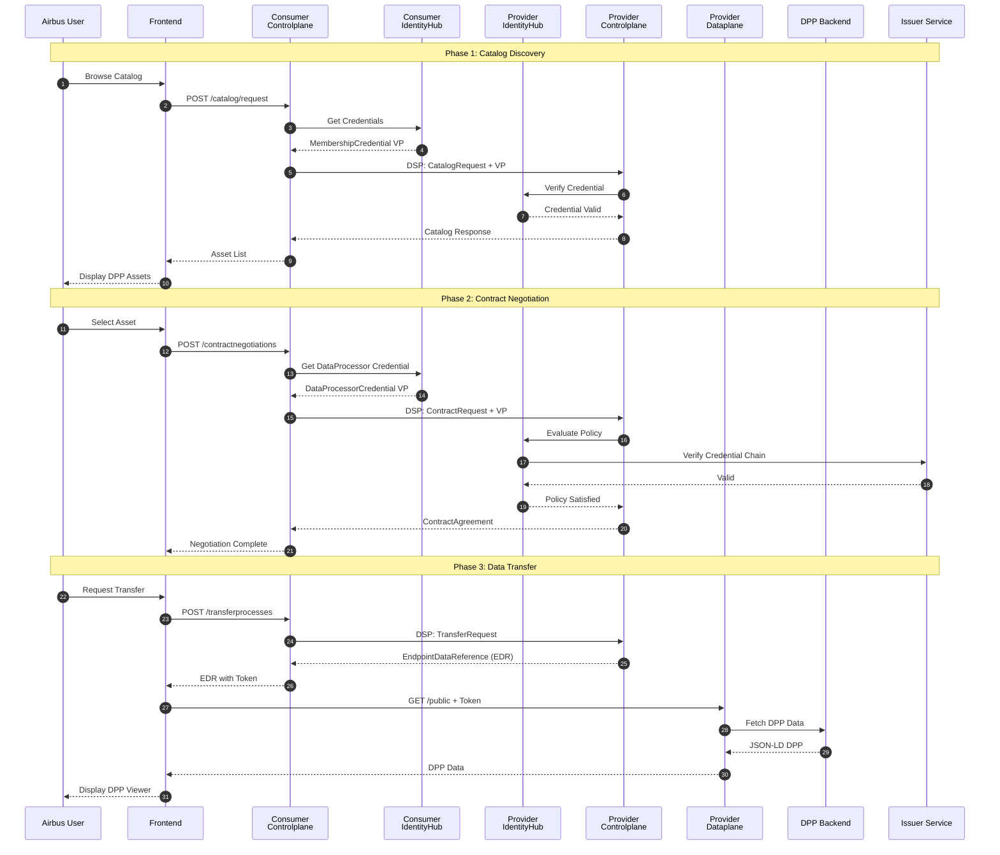
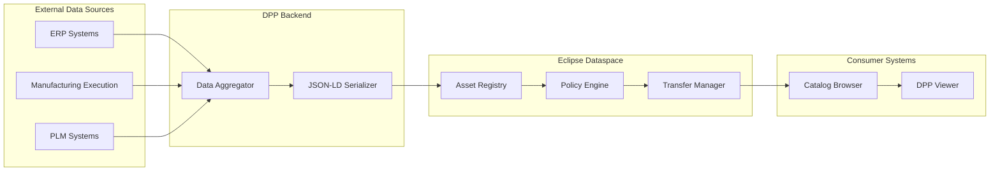
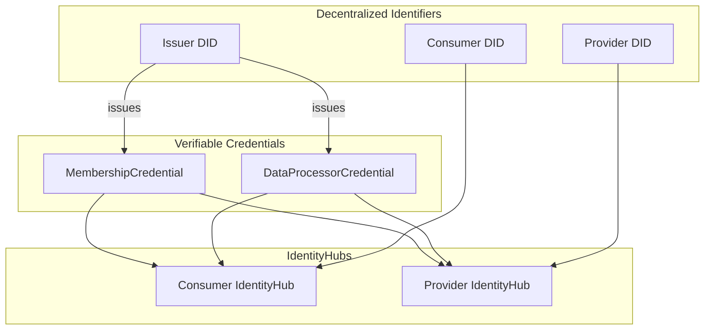
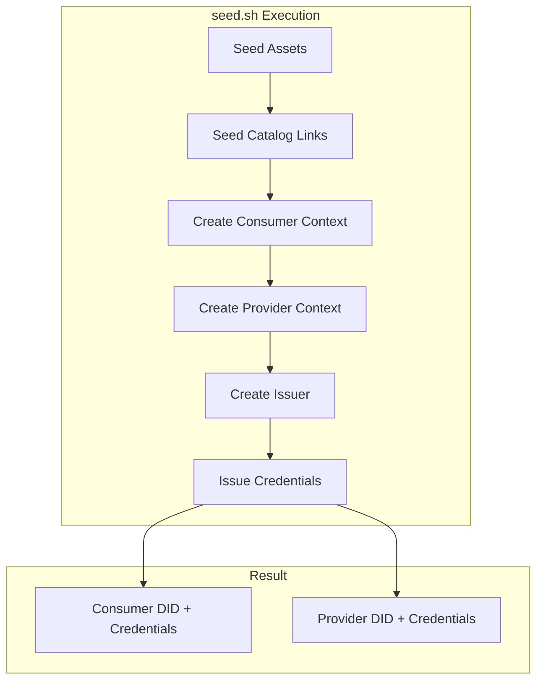
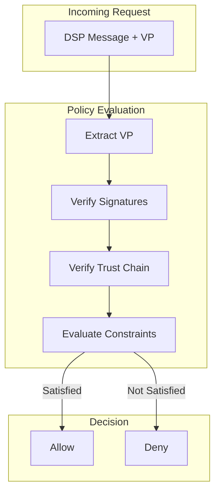

# DECADE-X Aerospace Digital Product Passport Demo

A comprehensive demonstration of sovereign data exchange for aerospace Digital Product Passports (DPP) using Eclipse Dataspace Components within the DECADE-X initiative.

---

## Table of Contents

1. [Introduction](#1-introduction)
   - 1.1 [Purpose](#11-purpose)
   - 1.2 [DECADE-X Context](#12-decade-x-context)
   - 1.3 [Demo Scenario](#13-demo-scenario)
2. [Architecture Overview](#2-architecture-overview)
   - 2.1 [System Components](#21-system-components)
   - 2.2 [Component Interaction Diagram](#22-component-interaction-diagram)
   - 2.3 [Data Flow Architecture](#23-data-flow-architecture)
   - 2.4 [Identity & Trust Framework](#24-identity--trust-framework)
3. [Technical Components](#3-technical-components)
   - 3.1 [Eclipse Dataspace Components (EDC)](#31-eclipse-dataspace-components-edc)
   - 3.2 [IdentityHub & Decentralized Claims Protocol](#32-identityhub--decentralized-claims-protocol)
   - 3.3 [Demo Application Components](#33-demo-application-components)
4. [Deployment Manual](#4-deployment-manual)
   - 4.1 [Prerequisites](#41-prerequisites)
   - 4.2 [Phase 1: Infrastructure Setup](#42-phase-1-infrastructure-setup)
   - 4.3 [Phase 2: Start Eclipse Dataspace Components](#43-phase-2-start-eclipse-dataspace-components)
   - 4.4 [Phase 3: Seed Identities and Credentials](#44-phase-3-seed-identities-and-credentials)
   - 4.5 [Phase 4: Deploy Demo Application](#45-phase-4-deploy-demo-application)
   - 4.6 [Phase 5: Seed Aerospace Assets](#46-phase-5-seed-aerospace-assets)
   - 4.7 [Verification Checklist](#47-verification-checklist)
5. [User Manual](#5-user-manual)
   - 5.1 [Accessing the Demo](#51-accessing-the-demo)
   - 5.2 [Consumer Workflow (Airbus)](#52-consumer-workflow-airbus)
   - 5.3 [Provider Workflow (Rolls-Royce)](#53-provider-workflow-rolls-royce)
   - 5.4 [Understanding the DPP Data](#54-understanding-the-dpp-data)
6. [Data Model Specification](#6-data-model-specification)
   - 6.1 [Digital Product Passport Structure](#61-digital-product-passport-structure)
   - 6.2 [EDC Asset Configuration](#62-edc-asset-configuration)
   - 6.3 [Policy Definitions](#63-policy-definitions)
7. [Credentials & Access Control](#7-credentials--access-control)
   - 7.1 [Verifiable Credentials](#71-verifiable-credentials)
   - 7.2 [Policy Evaluation Flow](#72-policy-evaluation-flow)
8. [API Reference](#8-api-reference)
   - 8.1 [EDC Management APIs](#81-edc-management-apis)
   - 8.2 [DPP Backend APIs](#82-dpp-backend-apis)
9. [Troubleshooting](#9-troubleshooting)
10. [Future Extensions](#10-future-extensions)

---

## 1. Introduction

### 1.1 Purpose

This demonstration showcases the secure, sovereign exchange of aerospace Digital Product Passports between industry participants using Eclipse Dataspace Components. It illustrates how OEMs and suppliers can share critical component data—including airworthiness certificates, sustainability metrics, and operational history—while maintaining full control over their data assets.

### 1.2 DECADE-X Context

DECADE-X (Decentralized European Collaborative Aerospace Data Exchange) represents a vision for a federated aerospace data ecosystem built on dataspace principles. This demo implements a key DECADE-X use case:

**Sovereign Data Exchange for Aerospace Supply Chain**
- **Data Sovereignty**: Each participant maintains control over their data and access policies
- **Interoperability**: Standardized protocols (DSP) enable seamless B2B data exchange
- **Trust Framework**: Decentralized identity (DIDs) and Verifiable Credentials establish trust without central authorities
- **Regulatory Compliance**: Supports EASA requirements for digital documentation and traceability

### 1.3 Demo Scenario

The demo simulates a real-world aerospace supply chain data exchange:



**Participants:**
- **Rolls-Royce** (Provider): Manufactures Trent XWB engine components and provides Digital Product Passports
- **Airbus** (Consumer): Procures engine components and requires DPP data for fleet management

**Data Exchanged:**
- Airworthiness certificates (EASA Form 1)
- Product Carbon Footprint (PCF) data
- Operational metrics (flight hours, cycles)
- Technical specifications

---

## 2. Architecture Overview

### 2.1 System Components

The demo architecture consists of three layers:



### 2.2 Component Interaction Diagram

The following diagram shows the complete data exchange flow:



### 2.3 Data Flow Architecture



### 2.4 Identity & Trust Framework



---

## 3. Technical Components

### 3.1 Eclipse Dataspace Components (EDC)

The EDC provides the core dataspace functionality:

**Controlplane** - Handles protocol messages, contract negotiation, and policy enforcement
- Consumer Controlplane: `http://localhost:8081`
- Provider QNA Controlplane: `http://localhost:8191`

**Dataplane** - Executes actual data transfers
- Consumer Dataplane: `http://localhost:11001`
- Provider QNA Dataplane: `http://localhost:11002`

**Catalog Server** - Federated catalog for asset discovery
- Provider Catalog Server: `http://localhost:8091`

### 3.2 IdentityHub & Decentralized Claims Protocol

The IdentityHub manages participant identities and credentials:

**Consumer IdentityHub**: `http://localhost:7082`
- Stores Consumer's DID document
- Holds MembershipCredential and DataProcessorCredential
- Issues Verifiable Presentations for DSP messages

**Provider IdentityHub**: `http://localhost:7092`
- Stores Provider's DID document
- Verifies incoming credential presentations
- Manages provider's own credentials

**Issuer Service**: `http://localhost:10016`
- Trusted third party issuing credentials
- Signs credentials with issuer's private key
- DID: `did:web:localhost%3A9876:issuer`

### 3.3 Demo Application Components

**Frontend** (React/TypeScript)
- URL: `http://localhost:3000`
- Features: Catalog browser, contract negotiation UI, DPP viewer
- Technology: Vite, React 18, TailwindCSS

**DPP Backend** (Node.js/Express)
- URL: `http://localhost:3001`
- Serves mock DPP data in JSON-LD format
- Simulates Rolls-Royce internal systems

---

## 4. Deployment Manual

### 4.1 Prerequisites

Ensure the following are installed:

| Software | Version | Purpose |
|----------|---------|--------|
| Java | 17+ (temurin-22 recommended) | EDC runtimes |
| Node.js | 18+ or 20+ | Frontend & backend |
| Docker | Latest | Container runtime |
| Docker Compose | Latest | Container orchestration |
| Newman | Latest | Postman CLI for seeding |
| jq | Latest | JSON processing |
| IntelliJ IDEA | 2023+ (recommended) | IDE with run configurations |

**Install Newman (if not present):**
```bash
npm install -g newman
```

### 4.2 Phase 1: Infrastructure Setup

**Step 1.1: Clone and Build MVD**
```bash
cd /path/to/MinimumViableDataspace
./gradlew build
```

**Step 1.2: Start NGINX for Issuer DID Document**

The issuer's DID document must be accessible via HTTP:

```bash
docker run -d --name nginx -p 9876:80 --rm \
  -v "$PWD"/deployment/assets/issuer/nginx.conf:/etc/nginx/nginx.conf:ro \
  -v "$PWD"/deployment/assets/issuer/did.docker.json:/var/www/.well-known/did.json:ro \
  nginx
```

**Verify:** `curl http://localhost:9876/.well-known/did.json` should return the issuer's DID document.

### 4.3 Phase 2: Start Eclipse Dataspace Components

**Option A: IntelliJ IDEA (Recommended for Development)**

1. Open the project in IntelliJ IDEA
2. Navigate to `.run/` directory
3. Run the `dataspace` compound run configuration
4. Wait for all 8 runtimes to start: consumer, consumer-identityhub, provider-qna, provider-manufacturing, provider-catalog-server, provider-identityhub, issuerservice

**Option B: Kubernetes (Production-like)**

```bash
# Build with persistence
./gradlew -Ppersistence=true build
./gradlew -Ppersistence=true dockerize

# Create KinD cluster
kind create cluster -n mvd --config deployment/kind.config.yaml

# Load images
kind load docker-image controlplane:latest dataplane:latest \
  identity-hub:latest catalog-server:latest issuerservice:latest -n mvd

# Deploy with Terraform
cd deployment
terraform init
terraform apply
```

**Verify EDC is running:**
```bash
# Consumer health check
curl http://localhost:8081/api/check/health

# Provider health check  
curl http://localhost:8191/api/check/health
```

### 4.4 Phase 3: Seed Identities and Credentials

This critical step creates participant contexts in the IdentityHubs and issues Verifiable Credentials.

```bash
./seed.sh
```

**What seed.sh does:**



**Expected Output:**
```
Create consumer participant context in IdentityHub
Create provider participant context in IdentityHub
Create dataspace issuer
```

**Verify credentials were issued:**
```bash
# Check consumer credentials
curl -s http://localhost:7082/api/identity/v1alpha/participants/ \
  -H "x-api-key: c3VwZXItdXNlcg==.c3VwZXItc2VjcmV0LWtleQo=" | jq
```

### 4.5 Phase 4: Deploy Demo Application

**Step 4.1: Start DPP Backend**

```bash
cd backend-mock
npm install
npm run dev
```

The backend starts on port 3001 and serves DPP data.

**Verify:** `curl http://localhost:3001/health`

**Step 4.2: Start Frontend**

**Option A: Development Mode**
```bash
cd frontend
npm install
npm run dev
```

**Option B: Docker Compose**
```bash
docker-compose -f docker-compose.aerospace.yml up --build
```

This starts both the frontend (port 3000) and backend (port 3001).

### 4.6 Phase 5: Seed Aerospace Assets

After the dataspace is running and seeded, add the aerospace-specific assets:

```bash
# For local development
DPP_BACKEND_URL=http://localhost:3001 ./seed-aerospace.sh

# For Docker deployment
DPP_BACKEND_URL=http://host.docker.internal:3001 ./seed-aerospace.sh
```

**What seed-aerospace.sh creates:**

| Entity | ID | Description |
|--------|-----|-------------|
| Asset | `asset:propulsion:blade:98765` | HPT Blade DPP |
| Asset | `asset:propulsion:blade:98766` | Compressor Blade DPP |
| Asset | `asset:propulsion:combustor:98767` | Combustor Liner DPP |
| Policy | `aerospace-membership-required` | Requires MembershipCredential |
| Policy | `aerospace-dpp-access` | Requires DataProcessorCredential |
| Contract | `aerospace-dpp-contract` | Links assets to policies |

### 4.7 Verification Checklist

Use this checklist to verify the deployment:

| Check | Command | Expected Result |
|-------|---------|----------------|
| NGINX running | `curl http://localhost:9876/.well-known/did.json` | DID document JSON |
| Consumer EDC | `curl http://localhost:8081/api/check/health` | `{"isSystemHealthy":true}` |
| Provider EDC | `curl http://localhost:8191/api/check/health` | `{"isSystemHealthy":true}` |
| DPP Backend | `curl http://localhost:3001/health` | `{"status":"healthy"}` |
| Frontend | Open `http://localhost:3000` | React app loads |
| Catalog Query | See API test below | Assets returned |

**Test Catalog Query:**
```bash
curl -X POST http://localhost:8081/api/catalog/v1alpha/catalog/query \
  -H "Content-Type: application/json" \
  -d '{
    "@context": {"edc": "https://w3id.org/edc/v0.0.1/ns/"},
    "@type": "QuerySpec"
  }'
```

---

## 5. User Manual

### 5.1 Accessing the Demo

Open your browser and navigate to: **http://localhost:3000**

The interface allows switching between Consumer (Airbus) and Provider (Rolls-Royce) perspectives.

### 5.2 Consumer Workflow (Airbus)


**Step 1: Select Consumer Role**
- Click "Consumer (Airbus)" in the role switcher
- The interface shows the consumer perspective

**Step 2: Browse Catalog**
- Click "Refresh Catalog" to fetch available DPPs
- The catalog shows assets from Rolls-Royce
- Each asset displays: Name, Part Type, Serial Number

**Step 3: Select Asset**
- Click on an asset card to select it
- View asset details including description and properties

**Step 4: Negotiate Contract**

Click "Negotiate Contract". The system automatically requests the asset's policy, presents required credentials (MembershipCredential, DataProcessorCredential), and completes the negotiation. Wait for status: "FINALIZED".

**Step 5: Transfer Data**

Click "Start Transfer". The system initiates an HTTP-PULL transfer, receives an Endpoint Data Reference (EDR), and fetches the DPP data. Wait for status: "STARTED".

**Step 6: View DPP**

The Digital Product Passport is displayed. Navigate through sections: **Identity** (Part number, serial number, manufacturer), **Airworthiness** (EASA Form 1 status, certifications), **Sustainability** (PCF value, material composition), **Operational** (Flight hours, cycles), and **Technical** (Specifications, dimensions).

### 5.3 Provider Workflow (Rolls-Royce)

**Step 1: Select Provider Role**
- Click "Provider (Rolls-Royce)" in the role switcher

**Step 2: View Registered Assets**
- See all DPP assets registered in the provider's EDC
- View asset metadata and data addresses

**Step 3: Monitor Activity**
- Check the backend logs for incoming requests:
  ```bash
  docker logs dpp-backend -f
  ```

### 5.4 Understanding the DPP Data

The Digital Product Passport contains structured data following aerospace standards:

**Identity Node** - Part identification per ATA Spec 2000
- Manufacturer Name, CAGE Code
- Part Number, Serial Number
- Manufacturing Date & Location

**Airworthiness Node** - Certification data per EASA regulations
- Form Type (EASA Form 1)
- Status: NEW, OVERHAULED, SERVICEABLE
- Certification Authority, Approval Date

**Sustainability Node** - Environmental data per IPC-1754
- Product Carbon Footprint (PCF) in kgCO2e
- Scope: Cradle-to-Gate
- Material Composition percentages

**Operational Node** - Lifecycle data per S5000F
- Time Since New (hours)
- Cycles Since New
- Time/Cycles Since Overhaul

---

## 6. Data Model Specification

### 6.1 Digital Product Passport Structure

The DPP follows a JSON-LD Verifiable Credential format:

```json
{
  "@context": [
    "https://www.w3.org/2018/credentials/v1",
    "https://w3id.org/aerospace/dpp/v1"
  ],
  "id": "did:web:rolls-royce.com:parts:serial:98765-XYZ-123",
  "type": ["VerifiableCredential", "AerospacePartPassport"],
  "issuer": "did:web:rolls-royce.com",
  "issuanceDate": "2025-10-27T10:00:00Z",
  "credentialSubject": {
    "id": "did:web:rolls-royce.com:parts:serial:98765-XYZ-123",
    "partType": "HighPressureTurbineBlade",
    "sku": "RR-TrentXWB-HPT-Blade-001",
    "identityNode": {
      "manufacturerName": "Rolls-Royce plc",
      "cageCode": "K1039",
      "partNumber": "FW12345",
      "serialNumber": "HPT998877",
      "batchNumber": "BATCH-2025-001",
      "manufacturingDate": "2025-09-15",
      "manufacturingLocation": "Derby, United Kingdom"
    },
    "airworthinessNode": {
      "formType": "EASA_FORM_1",
      "formTrackingNumber": "RR-DERBY-2025-00451",
      "status": "NEW",
      "certificationAuthority": "EASA",
      "qualityStandards": ["AS9100D", "ISO9001:2015"]
    },
    "sustainabilityNode": {
      "pcfValue": 45.2,
      "pcfUnit": "kgCO2e",
      "scope": "Cradle-to-Gate",
      "recyclableContent": 15,
      "materialComposition": [
        { "material": "Nickel Superalloy", "percentage": 85 },
        { "material": "Thermal Barrier Coating", "percentage": 10 }
      ]
    },
    "operationalNode": {
      "timeSinceNew": 0,
      "cyclesSinceNew": 0,
      "maximumOperatingHours": 25000,
      "maximumCycles": 15000
    },
    "technicalSpecifications": {
      "engineModel": "Trent XWB-97",
      "stage": "HP Turbine Stage 1",
      "weight": { "value": 0.85, "unit": "kg" },
      "operatingTemperature": { "max": 1700, "unit": "°C" }
    }
  }
}
```

### 6.2 EDC Asset Configuration

Assets are registered with the following structure:

```json
{
  "@context": ["https://w3id.org/edc/connector/management/v0.0.1"],
  "@id": "asset:propulsion:blade:98765",
  "@type": "Asset",
  "properties": {
    "name": "Trent XWB HPT Blade - Digital Product Passport",
    "description": "DPP for HPT Blade SN:HPT998877",
    "contenttype": "application/ld+json",
    "dct:type": "ids:DigitalProductPassport",
    "aerospace:partType": "HighPressureTurbineBlade",
    "aerospace:manufacturer": "Rolls-Royce plc",
    "aerospace:serialNumber": "HPT998877"
  },
  "dataAddress": {
    "@type": "DataAddress",
    "type": "HttpData",
    "baseUrl": "http://localhost:3001/api/parts/98765"
  }
}
```

### 6.3 Policy Definitions

**Access Policy (aerospace-membership-required):**
```json
{
  "@id": "aerospace-membership-required",
  "policy": {
    "@type": "Set",
    "permission": [{
      "action": "use",
      "constraint": {
        "leftOperand": "MembershipCredential",
        "operator": "eq",
        "rightOperand": "active"
      }
    }]
  }
}
```

**Contract Policy (aerospace-dpp-access):**
```json
{
  "@id": "aerospace-dpp-access",
  "policy": {
    "@type": "Set",
    "obligation": [{
      "action": "use",
      "constraint": {
        "leftOperand": "DataAccess.level",
        "operator": "eq",
        "rightOperand": "processing"
      }
    }]
  }
}
```

---

## 7. Credentials & Access Control

### 7.1 Verifiable Credentials

The demo uses two types of credentials:

**MembershipCredential**
- Issued by: Dataspace Issuer
- Purpose: Proves membership in the aerospace dataspace
- Required for: Catalog access

**DataProcessorCredential**

Issued by: Dataspace Issuer. Purpose: Proves authorization to process certain data types. Levels: `processing` (can access standard DPP data) and `sensitive` (can access restricted data, not used in demo). Required for: Contract negotiation.

### 7.2 Policy Evaluation Flow



---

## 8. API Reference

### 8.1 EDC Management APIs

**Consumer Endpoints (port 8081):**

| Endpoint | Method | Description |
|----------|--------|-------------|
| `/api/management/v3/catalog/request` | POST | Request remote catalog |
| `/api/catalog/v1alpha/catalog/query` | POST | Query cached catalog |
| `/api/management/v3/contractnegotiations` | POST | Start negotiation |
| `/api/management/v3/contractnegotiations/{id}` | GET | Get negotiation status |
| `/api/management/v3/transferprocesses` | POST | Start transfer |
| `/api/management/v3/edrs/{id}/dataaddress` | GET | Get data address |

**Provider Endpoints (port 8191):**

| Endpoint | Method | Description |
|----------|--------|-------------|
| `/api/management/v3/assets` | POST | Create asset |
| `/api/management/v3/assets/request` | POST | List assets |
| `/api/management/v3/policydefinitions` | POST | Create policy |
| `/api/management/v3/contractdefinitions` | POST | Create contract def |

### 8.2 DPP Backend APIs

| Endpoint | Method | Description |
|----------|--------|-------------|
| `/api/parts` | GET | List all DPPs |
| `/api/parts/98765` | GET | HPT Blade DPP |
| `/api/parts/98766` | GET | Compressor Blade DPP |
| `/api/parts/98767` | GET | Combustor Liner DPP |
| `/health` | GET | Health check |

---

## 9. Troubleshooting

**Problem: "No DPP assets found in catalog"**
- Ensure MVD runtimes are running
- Run `./seed.sh` first
- Run `./seed-aerospace.sh` after seed.sh
- Wait 5-10 seconds for catalog sync

**Problem: "Contract negotiation TERMINATED"**
- Check that credentials are properly issued
- Verify the provider is healthy: `curl http://localhost:8191/api/check/health`
- Check provider logs for policy evaluation errors

**Problem: "Frontend can't reach APIs"**
- In dev mode: Verify Vite proxy configuration
- In Docker: Ensure `host.docker.internal` resolves correctly
- Check CORS headers in responses

**Problem: "Credential verification failed"**
- Verify NGINX is serving the issuer DID: `curl http://localhost:9876/.well-known/did.json`
- Re-run `./seed.sh` to re-issue credentials
- Check IdentityHub logs for signature verification errors

**Problem: "Transfer stuck in STARTED"**
- This is normal - HTTP-PULL transfers remain in STARTED state
- Check if EDR was returned
- Try fetching data directly using the EDR token

---

## 10. Future Extensions

**Phase 2 Enhancements:**
- Usage control policies (time-limited access)
- Push transfers to cloud storage (S3, Azure Blob)
- Real-time data updates via WebSocket

**Phase 3 Enhancements:**
- Multi-tier supply chain (sub-supplier DPPs)
- Digital twin integration
- Blockchain anchoring for audit trails

**Phase 4 Enhancements:**
- AI-powered anomaly detection
- Predictive maintenance integration
- Full EASA compliance validation

---

## License

Apache License 2.0 - see LICENSE file

---

*This demo is part of the DECADE-X initiative for sovereign aerospace data exchange.*
