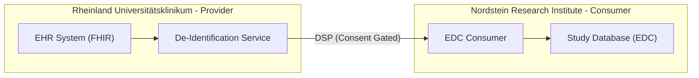
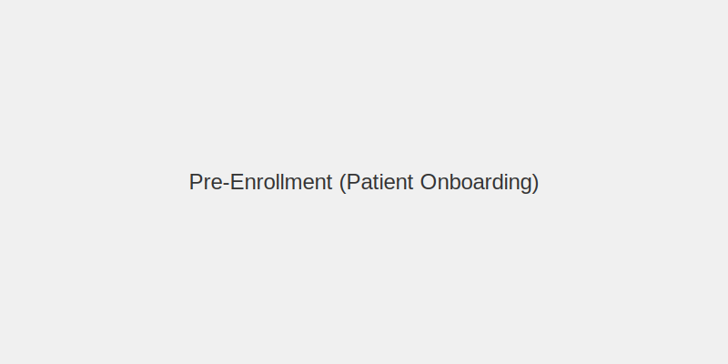
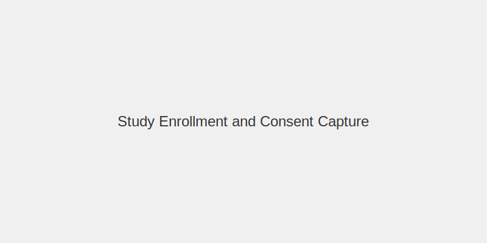
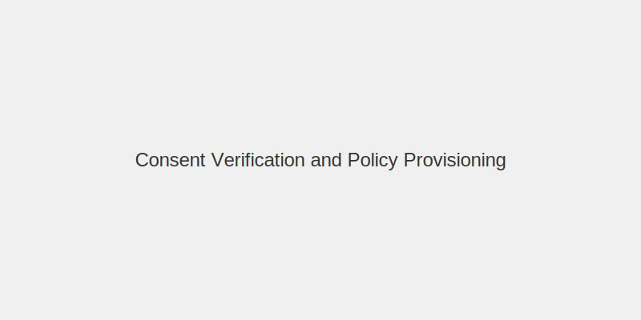
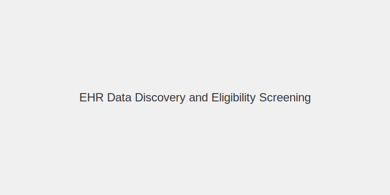
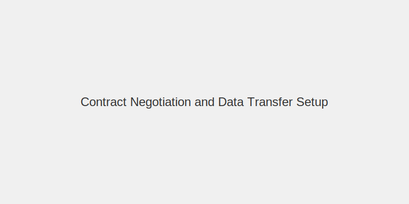
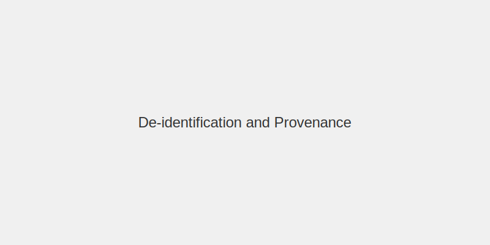
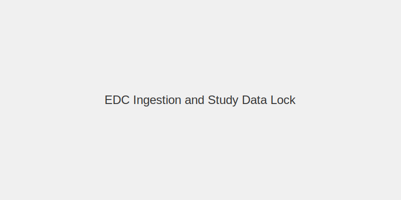
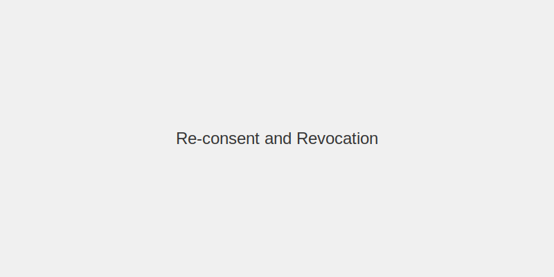

# EHR2EDC with High Privacy and Consent Management Demo

A comprehensive demonstration of secure, interoperable, and consent-managed access to health data for research (secondary use), aligned with the European Health Data Space (EHDS) and German Health Data Use Act (GDNG).

---

## Table of Contents

1. [Introduction](#1-introduction)
   - 1.1 [Purpose](#11-purpose)
   - 1.2 [Context & Initiatives](#12-context--initiatives)
   - 1.3 [Demo Scenario](#13-demo-scenario)
2. [User Journey](#2-user-journey)
   - 2.1 [Pre-Enrollment](#21-pre-enrollment-patient-onboarding)
   - 2.2 [Study Enrollment](#22-study-enrollment-and-consent-capture)
   - 2.3 [Consent Verification](#23-consent-verification-and-policy-provisioning)
   - 2.4 [Data Discovery](#24-ehr-data-discovery-and-eligibility-screening)
   - 2.5 [Contract Negotiation](#25-contract-negotiation-and-data-transfer-setup)
   - 2.6 [De-identification](#26-de-identification-and-provenance)
   - 2.7 [EDC Ingestion](#27-edc-ingestion-and-study-data-lock)
   - 2.8 [Re-consent & Revocation](#28-re-consent-and-revocation)
3. [Architecture Overview](#3-architecture-overview)
4. [Deployment Manual](#4-deployment-manual)
5. [User Manual](#5-user-manual)

---

## 1. Introduction

### 1.1 Purpose
This demonstration showcases the extraction of consent-gated Electronic Health Records (EHR) into an Electronic Data Capture (EDC) system for clinical research (EHR2EDC). It emphasizes strong privacy, granular consent management, and data sovereignty using Eclipse Dataspace Components.

### 1.2 Context & Initiatives
- **European Health Data Space (EHDS)**: Mandates secure secondary use of health data ("HealthData@EU").
- **Sphin-X & GDNG**: Focus on decentralized access and "Data Visiting" (Compute-to-Data) to minimize privacy risks.
- **Prometheus-X**: Provides architectural blueprints for consent and contract negotiation.

### 1.3 Demo Scenario
The demo simulates a clinical research study where a Contract Research Organization (CRO) requests access to patient data held by a Healthcare Provider.

**Participants:**
- **Rheinland Universitätsklinikum** (Provider): A hospital holding patient EHR data.
- **Nordstein Research Institute** (Consumer): A CRO conducting a clinical study.
- **Patient**: The data subject who grants consent.



## 2. User Journey

This section outlines the step-by-step process of the EHR2EDC use case.

### 2.1 Pre-Enrollment (Patient Onboarding)
The patient receives study information and a DID wallet link. They verify the Issuer DID and obtain Membership credentials to the healthcare network.



### 2.2 Study Enrollment and Consent Capture
The patient reviews the protocol-specific consent. Upon agreement, the Issuer issues a **ConsentCredential** to the Patient's DID, which can be presented to the provider.



### 2.3 Consent Verification and Policy Provisioning
The Consumer (CRO) queries the catalog. The Provider evaluates access policies using the IdentityHub. Access is granted only if the **ConsentCredential** matches the study purpose and validity period.



### 2.4 EHR Data Discovery and Eligibility Screening
The Consumer submits criteria (e.g., ICD-10 codes, age range) to discover eligible data. The Provider responds with aggregate counts (preserving privacy) to aid in feasibility analysis without revealing raw data.



### 2.5 Contract Negotiation and Data Transfer Setup
The Consumer requests a contract, presenting their **MembershipCredential** and **DataProcessorCredential**. The Provider returns a ContractAgreement and an EndpointDataReference (EDR) for the scoped FHIR bundle.



### 2.6 De-identification and Provenance
Before transfer, the Provider's dataplane runs a de-identification pipeline (removing direct identifiers, pseudonymizing). A **Provenance VC** is attached to record the transformation steps.



### 2.7 EDC Ingestion and Study Data Lock
The Consumer fetches the de-identified FHIR Bundle, transforms it to CDISC SDTM/ODM standards, and loads it into their EDC system. The data is locked and an audit trail is maintained.



### 2.8 Re-consent and Revocation
If the protocol changes, the patient is notified to re-consent. If the patient revokes consent, the ConsentCredential status is updated, and the Provider enforces recall obligations.



## 3. Architecture Overview

The solution leverages the **Eclipse Dataspace Components (EDC)** for sovereign data exchange and **IdentityHub** for managing Verifiable Credentials.

*   **Provider Side**: EHR Adapter → De-ID Service → Provider Controlplane/Dataplane → IdentityHub.
*   **Consumer Side**: EDC Consumer → EDC-to-EDC (EDC) → Study EDC System.
*   **Trust**: Issuer Service issues MembershipCredential and DataProcessorCredential.

## 4. Deployment Manual

### 4.1 Prerequisites
*   Java 17+
*   Docker & Docker Compose
*   Kind (Kubernetes in Docker) - Optional for K8s deployment

### 4.2 Setup Steps

1.  **Infrastructure Setup**:
    Start the MVD infrastructure (EDC connectors, IdentityHubs) using your preferred method (Gradle or Kubernetes).

2.  **Seed Identities**:
    Initialize the basic identities and credentials.
    ```bash
    ./seed.sh
    ```

3.  **Seed Health Data**:
    This script seeds the Rheinland Universitätsklinikum with anonymized EHR records.
    ```bash
    ./seed-health.sh
    ```

4.  **Deploy Demo Application**:
    Start the frontend and backend mock services.
    ```bash
    docker-compose -f docker-compose.health.yml up -d
    ```

## 5. User Manual

### 5.1 Accessing the Demo
*   **Frontend**: http://localhost:3000
*   **Provider Control Plane**: http://localhost:9191
*   **Consumer Control Plane**: http://localhost:9192

### 5.2 Workflows
Follow the steps outlined in the [User Journey](#2-user-journey) section to simulate the interaction between the Patient, Provider, and Consumer.
