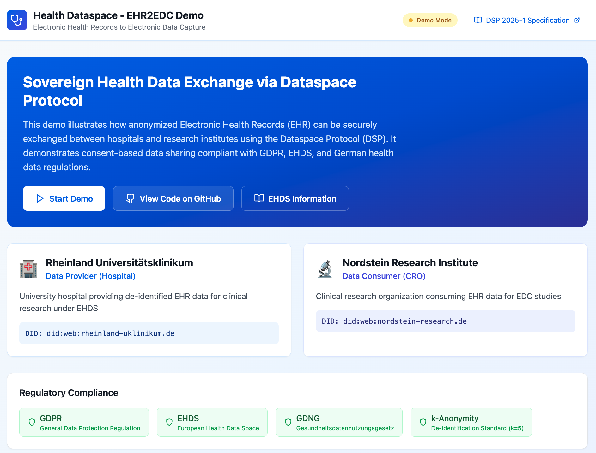
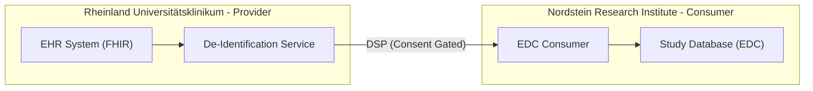
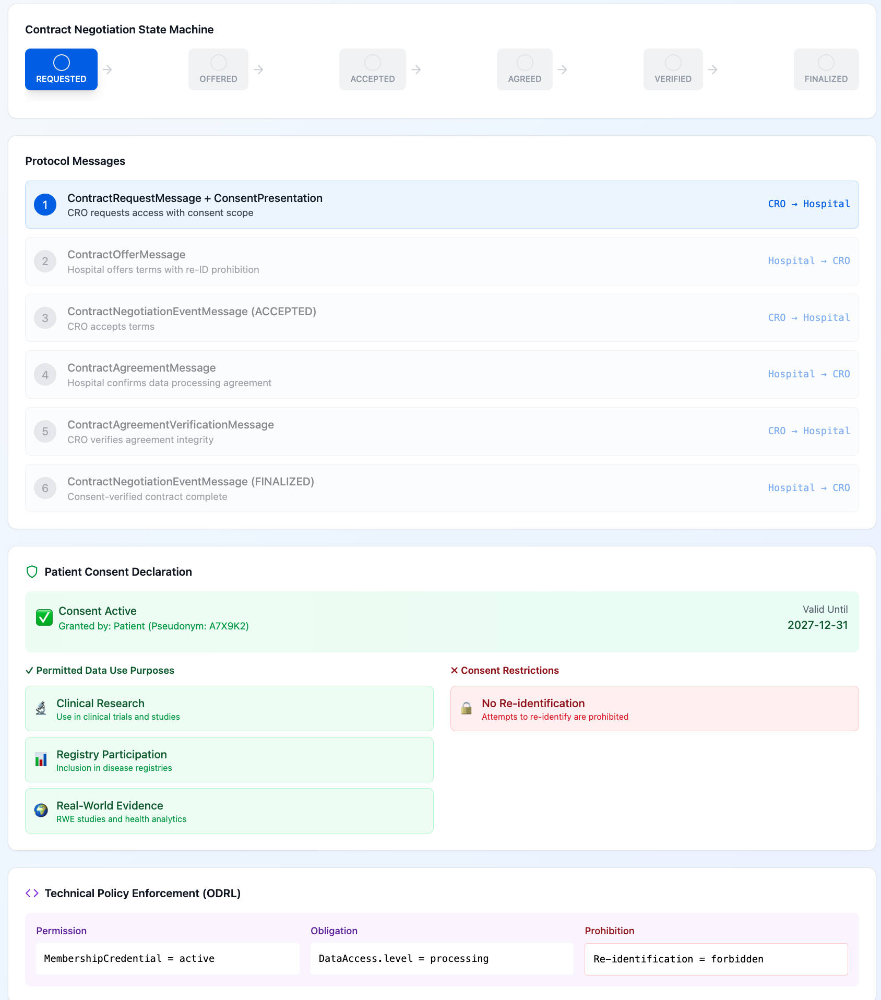
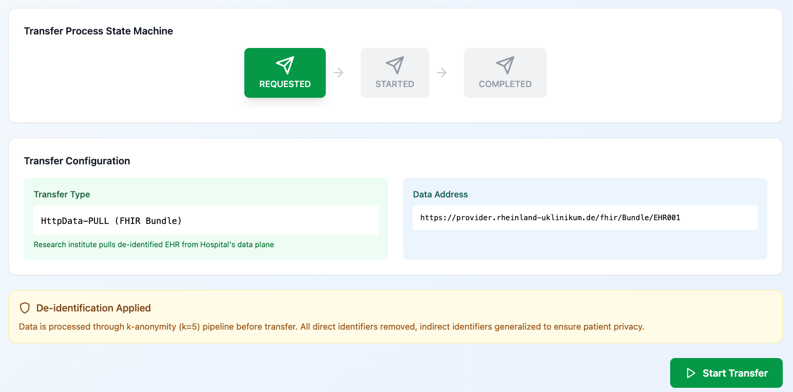
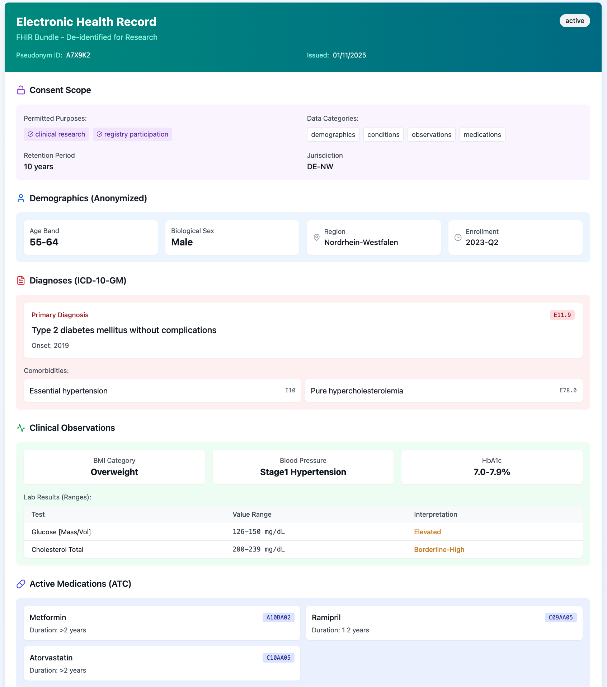
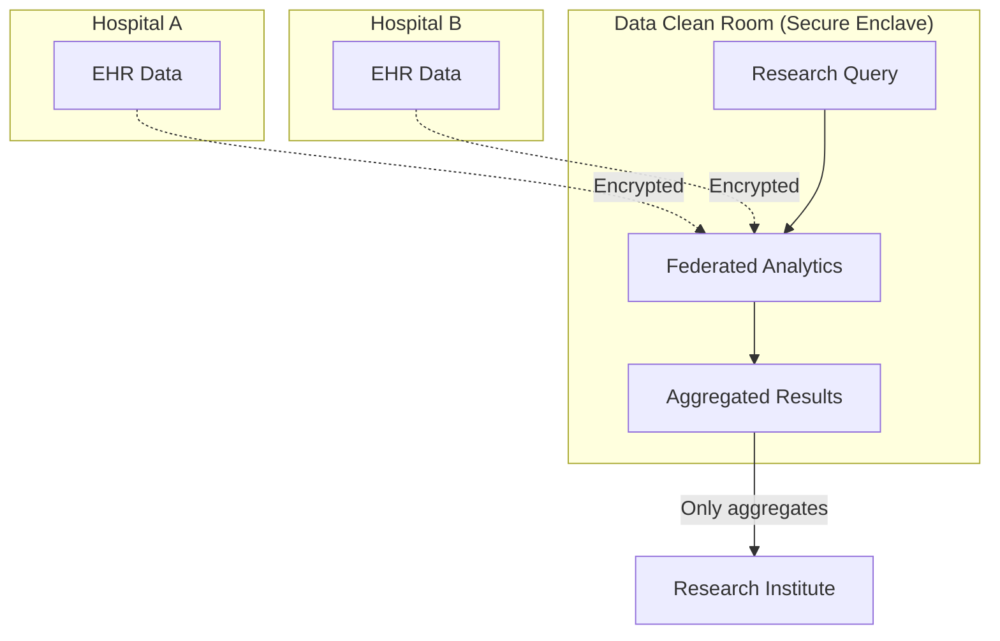
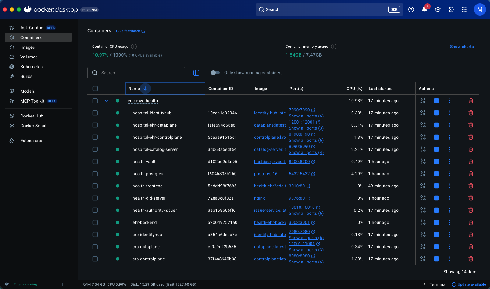

# Health Data Exchange with High Privacy and Consent Management Demo

A comprehensive demonstration of secure, interoperable, and consent-managed access to health data for research (secondary use), aligned with the European Health Data Space (EHDS) and German Health Data Use Act (GDNG). We utilize the Dataspace Protocol,  Eclipse Dataspace Components (EDC) for sovereign data exchange, IdentityHub for verifiable credential management, and implement strong privacy-preserving techniques.

---

## Table of Contents

1. [Introduction](#1-introduction)
   - 1.1 [Purpose](#11-purpose)
   - 1.2 [Context & Initiatives](#12-context--initiatives)
   - 1.3 [Demo Scenario](#13-demo-scenario)
2. [User Journey](#2-user-journey)
   - 2.1 [Pre-Enrollment](#21-pre-enrollment-patient-onboarding)
   - 2.2 [Study Enrollment](#22-study-enrollment-and-consent-capture)
   - 2.3 [Consent Verification](#23-consent-verification-and-policy-provisioning)
   - 2.4 [Data Discovery](#24-ehr-data-discovery-and-eligibility-screening)
   - 2.5 [Contract Negotiation](#25-contract-negotiation-and-data-transfer-setup)
   - 2.6 [De-identification](#26-de-identification-and-provenance)
   - 2.7 [EDC Ingestion](#27-edc-ingestion-and-study-data-lock)
   - 2.8 [Re-consent & Revocation](#28-re-consent-and-revocation)
3. [Architecture Overview](#3-architecture-overview)
4. [Deployment Manual](#4-deployment-manual)
5. [User Manual](#5-user-manual)

---

## 1. Introduction

### 1.1 Purpose
This demonstration showcases the extraction of consent-gated Electronic Health Records (EHR) into an Electronic Data Capture (EDC) system for clinical research (EHR2EDC). It emphasizes strong privacy, granular consent management, and data sovereignty using Eclipse Dataspace Components.

### 1.2 Context & Initiatives
- **European Health Data Space (EHDS)**: Mandates secure secondary use of health data ("HealthData@EU").
- **DCAT-AP for Health**: The demo implements the DCAT-AP for Health metadata standard for dataset description, ensuring semantic interoperability across the dataspace.
- **Sphin-X & GDNG**: Focus on decentralized access and "Data Visiting" (Compute-to-Data) to minimize privacy risks.
- **Prometheus-X**: Provides architectural blueprints for consent and contract negotiation.

### 1.3 Demo Scenario
The demo simulates a clinical research study where a  Research Organization requests access to patient data held by a Healthcare Provider.



**Participants:**
- **Rheinland Universitätsklinikum** (Provider): A hospital holding patient EHR data.
- **Nordstein Research Institute** (Consumer): A CRO conducting a clinical study.
- **Patient**: The data subject who grants consent.



## 2. User Journey

This section outlines the step-by-step process of the EHR2EDC use case.

### 2.1 Pre-Enrollment (Patient Onboarding)
The patient receives study information and a DID wallet link. They verify the Issuer DID and obtain Membership credentials to the healthcare network.

### 2.2 Study Enrollment and Consent Capture
The patient reviews the protocol-specific consent. Upon agreement, the Issuer issues a **ConsentCredential** to the Patient's DID, which can be presented to the provider.

### 2.3 Consent Verification and Policy Provisioning
The Consumer (CRO) queries the catalog. The Provider evaluates access policies using the IdentityHub. Access is granted only if the **ConsentCredential** matches the study purpose and validity period.


### 2.4 EHR Data Discovery and Eligibility Screening
The Consumer submits criteria (e.g., ICD-10 codes, age range) to discover eligible data. The Provider responds with aggregate counts (preserving privacy) to aid in feasibility analysis without revealing raw data.

### 2.5 Contract Negotiation and Data Transfer Setup
The Consumer requests a contract, presenting their **MembershipCredential** and **DataProcessorCredential**. The Provider returns a ContractAgreement and an EndpointDataReference (EDR) for the scoped FHIR bundle.



### 2.6 De-identification and Provenance
Before transfer, the Provider's dataplane runs a de-identification pipeline (removing direct identifiers, pseudonymizing). A **Provenance VC** is attached to record the transformation steps.

### 2.7 EDC Ingestion and Study Data Lock
The Consumer fetches the de-identified FHIR Bundle, transforms it to CDISC SDTM/ODM standards, and loads it into their EDC system. The data is locked and an audit trail is maintained.



### 2.8 Show Electronic Health Record

If the file transfer is successful, the study data can be viewed in the Electronic Health Record system.



### 2.9 Re-consent and Revocation
If the protocol changes, the patient is notified to re-consent. If the patient revokes consent, the ConsentCredential status is updated, and the Provider enforces recall obligations.

## 3. Architecture Overview

The solution leverages the **Eclipse Dataspace Components (EDC)** for sovereign data exchange and **IdentityHub** for managing Verifiable Credentials. It now incorporates the **DCAT-AP for Health** standard for metadata interoperability.

*   **Provider Side**: EHR Adapter → De-ID Service → Provider Controlplane/Dataplane → IdentityHub.
*   **Consumer Side**: EDC Consumer → EDC-to-EDC (EDC) → Study EDC System.
*   **Trust**: Issuer Service issues MembershipCredential and DataProcessorCredential.
*   **Metadata**: DCAT-AP for Health Editor (SHACL Validator) for validating dataset descriptions.

### Metadata Standard: DCAT-AP for Health

The demo implements the **DCAT-AP for Health** specification ([https://healthdcat-ap.github.io/](https://healthdcat-ap.github.io/)) for health dataset metadata, ensuring compliance with the **European Health Data Space (EHDS) Regulation** (EU 2025/327).

#### MANDATORY Properties (NON_PUBLIC Sensitive Health Data)

All 21 EHR catalog assets implement the mandatory DCAT-AP for Health properties for sensitive health data:

| Property | Description | Example Value |
|----------|-------------|---------------|
| `dcatap:applicableLegislation` | Governing regulations | EHDS (EU 2025/327), GDPR (EU 2016/679), DGA |
| `dct:type` | Dataset type | `PERSONAL_DATA` |
| `dct:accessRights` | Access level | `NON_PUBLIC` |
| `healthdcatap:healthCategory` | Art. 51 EHDS categories | `EHR`, `CLINICAL_TRIAL`, `RARE_DISEASE`, etc. |
| `healthdcatap:hdab` | Health Data Access Body | German FDZ (Forschungsdatenzentrum) |
| `dct:spatial` | Geographic coverage | EU country URIs |
| `dct:provenance` | Data provenance | Source and transformation details |
| `dpv:hasPurpose` | Processing purposes | `AcademicResearch`, `ScientificResearch` |
| `dpv:hasPersonalData` | Personal data categories | `HealthData`, `MedicalHealth`, `Genetic` |
| `dpv:hasLegalBasis` | GDPR legal basis | Art. 6.1.a, 9.2.a, 9.2.j |
| `healthdcatap:publishernote` | Ethics reference | Ethics committee approval numbers |
| `healthdcatap:publishertype` | Publisher type | Healthcare Provider, Research Organization |

#### RECOMMENDED Properties

| Property | Description | Example Value |
|----------|-------------|---------------|
| `healthdcatap:minTypicalAge` / `maxTypicalAge` | Age range | 18-85 |
| `healthdcatap:numberOfRecords` | Record count | 450-4500 |
| `healthdcatap:numberOfUniqueIndividuals` | Unique subjects | 45-450 |
| `healthdcatap:populationcoverage` | Population description | German hospital patient population |
| `healthdcatap:hasCodingSystem` | Coding standards (Wikidata) | ICD-10, LOINC, SNOMED CT, MedDRA |
| `healthdcatap:hasCodeValues` | Actual codes | ICD-10 codes, LOINC codes |

#### Art. 51 EHDS Health Categories

The demo maps assets to official EHDS health categories:
- `EHR` - Electronic Health Records
- `CLINICAL_TRIAL` - Clinical Trial Data
- `RARE_DISEASE` - Rare Disease Data
- `GENOMIC` - Genomic Data
- `HEALTH_REGISTRY` - Health Registries
- `CLAIMS` - Claims and Reimbursement Data
- `PUBLIC_HEALTH` - Public Health Surveillance
- And 10+ additional categories per Art. 51

#### Data Privacy Vocabulary (DPV) Integration

The demo uses W3C Data Privacy Vocabulary for:
- **Purposes**: `dpv:AcademicResearch`, `dpv:ScientificResearch`, `dpv:NonCommercialResearch`
- **Personal Data**: `dpv-pd:HealthData`, `dpv-pd:MedicalHealth`, `dpv-pd:Genetic`, `dpv-pd:Age`
- **Legal Basis**: GDPR articles via `dpv-gdpr` namespace

#### Export Formats

The catalog supports exporting metadata in:
- **Turtle (TTL)** - DCAT-AP for Health compliant RDF
- **JSON-LD** - Linked Data format with context

Use the "Export Catalog (Turtle)" button in the EHR viewer to download the complete DCAT-AP for Health metadata.

### Data Clean Rooms & Confidential Computing

The architecture supports privacy-preserving computation patterns aligned with EHDS "Data Visiting" principles:

#### Data Clean Room Concept

A **Data Clean Room (DCR)** provides a secure, neutral environment where multiple parties can collaborate on sensitive health data without exposing raw records:



**Key Principles:**
- **Data Never Leaves**: Raw patient data remains at the source; only queries travel to the data
- **Code-to-Data**: Researchers submit analysis code, not data extraction requests
- **Aggregate Only**: Only de-identified, aggregated results are returned
- **Audit Trail**: All queries and access are logged for compliance

#### Confidential Computing Integration

The demo is designed to integrate with **Confidential Computing** technologies for hardware-enforced data protection:

| Technology | Description | Use Case |
|------------|-------------|----------|
| **Intel SGX** | Secure enclaves for isolated execution | Query processing on encrypted EHR data |
| **AMD SEV** | Memory encryption for VMs | Secure multi-party analytics |
| **Azure Confidential Computing** | Cloud-based TEEs | Scalable federated learning |
| **AWS Nitro Enclaves** | Isolated compute environments | Cross-border EHDS data collaboration |

**Trusted Execution Environment (TEE) Workflow:**
1. Provider encrypts EHR data with enclave-specific keys
2. Consumer submits signed, attested analysis code
3. TEE decrypts data only inside the secure enclave
4. Computation runs in isolation (no external access)
5. Only approved outputs (aggregates, trained models) are released

#### EHDS Alignment

This approach directly implements EHDS Art. 50 requirements for Secure Processing Environments (SPE):
- **Art. 50(1)**: Data holders provide access via secure processing environments
- **Art. 50(3)**: SPEs must prevent unauthorized data extraction
- **Art. 50(4)**: Only non-identifying statistical results may be exported

**Future Roadmap:**
- Integration with Gaia-X Trusted Execution framework
- Support for differential privacy guarantees
- Federated learning across multiple Health Data Access Bodies (HDABs)
- Homomorphic encryption for queries on encrypted data

## 4. Developer Manual

### 4.1 Prerequisites
*   **Java**: Temurin 17+ (for EDC components)
*   **Node.js**: 18+ or 20+ (for frontend and backend mock)
*   **Docker & Docker Compose**: For running EDC infrastructure
*   **Build Tools**: Gradle (included via `gradlew`), npm

### 4.2 Local Development Setup

#### 4.2.1 Starting the Backend Mock (EHR Server)

The backend mock simulates a FHIR R4-compliant EHR system with 20 anonymized patient records enriched with clinical trial metadata.

```bash
# Navigate to backend-mock directory
cd backend-mock

# Install dependencies (first time only)
npm install

# Start the development server (uses ts-node for hot reload)
npm run dev:health
```

The backend will start on **http://localhost:3001**

**Verify backend is running:**
```bash
curl http://localhost:3001/health
# Expected output: {"status":"healthy","service":"ehr2edc-backend","recordsCount":20}
```

**Available endpoints:**
- `GET /health` - Health check
- `GET /api/ehr` - List all EHR records
- `GET /api/ehr/:id` - Get specific EHR record (e.g., EHR001)

**Note:** Use `npm run dev:health` (ts-node) instead of `npm run start:health` (compiled) during development to ensure code changes are reflected immediately without manual rebuilds.

#### 4.2.2 Starting the Frontend (React App)

The frontend provides the catalog browser and EHR viewer with advanced filtering capabilities.

```bash
# Navigate to frontend directory
cd frontend

# Install dependencies (first time only)
npm install

# Start the development server
npm run dev
```

The frontend will start on **http://localhost:3000**

**Development commands:**
```bash
npm run lint          # Run ESLint
npm run build         # Production build
npm run preview       # Preview production build
```

**Hot Module Replacement (HMR):** Vite automatically reloads changes. If you encounter issues, restart the dev server:
```bash
# Kill the process
pkill -f vite

# Restart
npm run dev
```

#### 4.2.3 Starting Both Services

**Option 1: Manual (recommended for development)**
```bash
# Terminal 1: Backend
cd backend-mock && npm run dev:health

# Terminal 2: Frontend
cd frontend && npm run dev
```

**Option 2: Background processes**
```bash
# Start backend in background
cd backend-mock && npm run dev:health > /tmp/backend.log 2>&1 &

# Start frontend in background
cd frontend && npm run dev > /tmp/frontend.log 2>&1 &

# Monitor logs
tail -f /tmp/backend.log
tail -f /tmp/frontend.log
```

#### 4.2.4 Starting the DCAT-AP for Health Editor

The DCAT-AP for Health Editor (Interoperability Test Bed SHACL Validator) is available as a Docker service. It allows you to validate and edit metadata against the DCAT-AP for Health SHACL shapes.

```bash
# Start the editor service
docker-compose -f docker-compose.health.yml up -d healthdcatap-editor
```

The editor will be available at **http://localhost:8082**.

**Option 3: Docker Compose (for full stack)**
```bash
# Start frontend + backend + EDC infrastructure + DCAT-AP for Health Editor
docker-compose -f docker-compose.health.yml up --build
```

### 4.3 Building the EDC Components

The MVD-health project includes custom EDC extensions and launchers.

```bash
# Build all Java components
./gradlew build

# Build with Docker images
./gradlew build dockerize

# Build with persistence enabled
./gradlew -Ppersistence=true build

# Run end-to-end tests
./gradlew :tests:end2end:test
```

### 4.4 Common Development Tasks

#### Seeding Data
After starting the EDC infrastructure, seed the dataspace with participants and EHR assets:

```bash
# Initialize basic identities and credentials
./seed.sh

# Seed health-specific EHR catalog (requires backend running on port 3001)
./seed-health.sh
```

#### Cleaning Ports
If you encounter "port already in use" errors:

```bash
# Check what's using ports 3000 and 3001
lsof -i:3000,3001

# Kill processes on these ports
kill $(lsof -ti:3000,3001)
```

#### Troubleshooting

**Backend not serving updated data:**
- Ensure you're using `npm run dev:health` (ts-node) not `npm run start:health` (compiled)
- Check that port 3001 is not occupied by another process

**Frontend shows blank page:**
- Check browser console for errors (F12)
- Verify Vite dev server started on port 3000 (not 3001)
- Restart the Vite server if HMR fails

**TypeScript compilation errors:**
- Run `npm install` to ensure dependencies are up to date
- Clear `dist/` folder: `rm -rf backend-mock/dist`

## 5. Deployment Manual

### 5.1 Prerequisites
*   Java 17+
*   Docker & Docker Compose
*   Kubernetes (optional, for production deployment)

### 5.2 Docker Compose Deployment

The simplest way to run the complete demo stack:

```bash
# Start all services (frontend, backend, EDC connectors, identity hubs)
docker-compose -f docker-compose.health.yml up --build

# Run in detached mode
docker-compose -f docker-compose.health.yml up -d --build

# View logs
docker-compose -f docker-compose.health.yml logs -f

# Stop all services
docker-compose -f docker-compose.health.yml down

# Clean volumes (removes all data)
docker-compose -f docker-compose.health.yml down -v
```

**After services are running, seed the dataspace:**
```bash
# Wait for all containers to be healthy (check logs)
docker-compose -f docker-compose.health.yml logs -f

# Seed participants, assets, and policies
./seed-health.sh
```

### 5.3 Infrastructure Components



The Docker Compose setup includes:
- **Frontend** (port 3000): React catalog browser
- **Backend Mock** (port 3001): FHIR R4 EHR server
- **Provider Connector**: Control Plane (8191) + Data Plane (11002)
- **Consumer Connector**: Control Plane (8081) + Data Plane (11001)
- **Provider Identity Hub** (7090-7096): Credential management
- **Consumer Identity Hub** (7080-7086): Credential management
- **Catalog Server** (8091): Federated asset catalog
- **Issuer Service** (10010-10015): Trust anchor for credentials

For detailed endpoint documentation, see the [Docker Endpoints Table](Health-EHR2EDC-UserJourney.md#101-docker-deployment-architecture--endpoints) in the User Journey document.

## 6. User Manual

### 6.1 Accessing the Demo

Once all services are running, access the demo through:

**Main Application:**
- **Frontend UI**: http://localhost:3000/
  - Browse EHR catalog with multi-dimensional filters
  - View detailed FHIR-compliant health records
  - See clinical trial metadata, MedDRA classifications, ADRs, and anamnesis

**Backend API:**
- **Backend Health Check**: http://localhost:3001/health
- **EHR Records**: http://localhost:3001/api/ehr
- **Specific Record**: http://localhost:3001/api/ehr/EHR001

**EDC Management APIs** (require auth header: `X-Api-Key: password`):
- **Provider Management**: http://localhost:8191/api/management/v3/
  - Assets: `/assets`
  - Policies: `/policydefinitions`
  - Catalog: `/catalog`
- **Consumer Management**: http://localhost:8081/api/management/v3/
  - Catalog Request: `/catalog/request`
  - Contract Negotiations: `/contractnegotiations`
  - Transfer Processes: `/transferprocesses`

**Identity & Credentials:**
- **Provider IdentityHub**: http://localhost:7092/api/identity
- **Consumer IdentityHub**: http://localhost:7082/api/identity
- **Issuer Service**: http://localhost:10012/api/issuance

**Example API calls:**
```bash
# Query provider catalog from consumer
curl -X POST http://localhost:8081/api/management/v3/catalog/request \
  -H "X-Api-Key: password" \
  -H "Content-Type: application/json" \
  -d '{
    "counterPartyAddress": "http://localhost:8192/api/dsp",
    "protocol": "dataspace-protocol-http"
  }'

# Get EHR record with clinical trial data
curl http://localhost:3001/api/ehr/EHR001 | jq '.credentialSubject | {
  diagnosis: .diagnosis,
  clinicalPhase: .clinicalTrialNode.phase,
  medDRA: .medDRANode.primarySOC.name,
  adrCount: .signalVerificationNode.adverseEvents | length
}'
```

### 6.2 Demo Workflow

Follow the interactive demo at http://localhost:3000/:

1. **Start Demo**: Click "Start Demo" button on the landing page
2. **Browse Catalog**: Use filters to find EHR datasets:
   - Medical Category (Cardiology, Oncology, etc.)
   - Age Band (18-24, 25-34, etc.)
   - Study Phase (Phase I-IV)
   - MedDRA SOC (System Organ Class)
   - Text search (diagnosis, ICD codes, phase, MedDRA terms)
3. **Select Record**: Click on an EHR card to select it
4. **Request Consent Verification**: Proceed to contract negotiation
5. **Review Contract**: See the DSP contract negotiation flow
6. **Transfer Data**: Initiate secure data transfer with de-identification
7. **View EHR**: Explore the complete FHIR record with:
   - Patient demographics and vital signs
   - Clinical trial information (phase, protocol, endpoints)
   - MedDRA classification (SOC and Preferred Terms)
   - Signal verification and Adverse Drug Reactions
   - 5-step Anamnesis (medical history)
   - Raw FHIR JSON (expandable)

### 6.3 Testing Components

#### Frontend Testing
```bash
cd frontend

# Run linter
npm run lint

# Build for production
npm run build

# Preview production build
npm run preview
```

#### Backend Testing
```bash
cd backend-mock

# Health check
curl http://localhost:3001/health

# List all records
curl http://localhost:3001/api/ehr | jq '.[]| .id'

# Verify clinical trial metadata
curl http://localhost:3001/api/ehr/EHR001 | jq '.credentialSubject | {
  hasClinicalTrial: (.clinicalTrialNode != null),
  hasMedDRA: (.medDRANode != null),
  hasSignalVerification: (.signalVerificationNode != null),
  hasAnamnesis: (.anamnesisNode != null)
}'
```

#### EDC Component Testing
```bash
# Check provider assets
curl -X POST http://localhost:8191/api/management/v3/assets/request \
  -H "X-Api-Key: password" \
  -H "Content-Type: application/json" \
  -d '{"offset": 0, "limit": 10}'

# Query catalog from consumer
curl -X POST http://localhost:8081/api/management/v3/catalog/request \
  -H "X-Api-Key: password" \
  -H "Content-Type: application/json" \
  -d '{
    "counterPartyAddress": "http://localhost:8192/api/dsp",
    "protocol": "dataspace-protocol-http"
  }' | jq '.dcat:dataset | length'
```

### 6.4 Advanced Features

**Multi-dimensional Filtering:**
The catalog page supports filtering by multiple dimensions simultaneously:
- Combine filters with AND logic (all conditions must match)
- Active filters are displayed as removable chips
- "Clear all" button resets all filters
- Search includes: diagnosis, ICD codes, phase names, MedDRA terms, age bands

**Clinical Trial Metadata:**
Each EHR record includes:
- **Phase**: Phase I (First-in-Human), Phase II (Efficacy), Phase III (Confirmation), Phase IV (Post-Marketing)
- **MedDRA v27.0**: System Organ Class (SOC) with 10-digit codes, Preferred Terms (PT)
- **ADRs**: Adverse Drug Reactions with severity, relatedness, causality, outcome
- **Anamnesis**: 5-step medical history (Chief Complaint, HPI, PMH, Family History, Social History)

**FHIR Compliance:**
All data follows FHIR R4 standards and includes:
- Patient resources with demographics
- Condition resources with ICD-10-GM codes
- Observation resources (vital signs, lab results)
- Procedure and Medication resources
- Extensions for clinical trial and safety data

### 6.5 Troubleshooting

**Page shows blank or errors:**
- Check browser console (F12) for JavaScript errors
- Verify backend is running: `curl http://localhost:3001/health`
- Restart frontend: `pkill -f vite && cd frontend && npm run dev`

**No data in catalog:**
- Run seed script: `./seed-health.sh`
- Check provider assets: `curl -X POST http://localhost:8191/api/management/v3/assets/request -H "X-Api-Key: password" -H "Content-Type: application/json" -d '{"offset": 0, "limit": 10}'`

**Port conflicts:**
- Frontend needs port 3000 free
- Backend needs port 3001 free
- Kill conflicting processes: `kill $(lsof -ti:3000,3001)`

**Docker services not starting:**
- Check logs: `docker-compose -f docker-compose.health.yml logs -f`
- Clean volumes: `docker-compose -f docker-compose.health.yml down -v`
- Rebuild: `docker-compose -f docker-compose.health.yml up --build`
