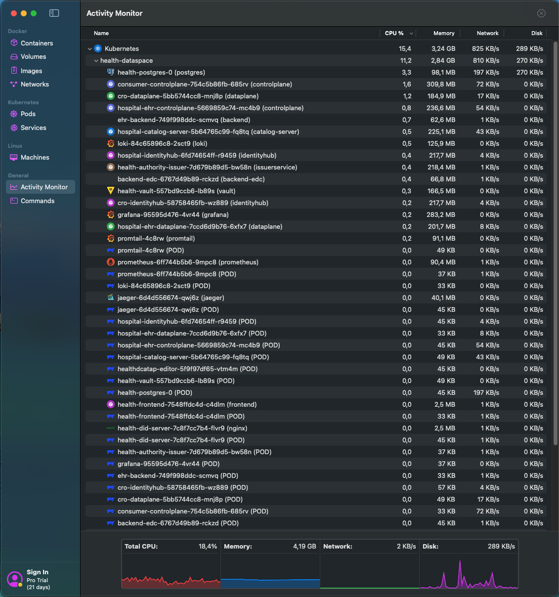
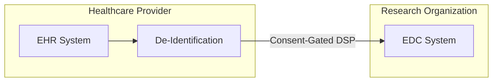
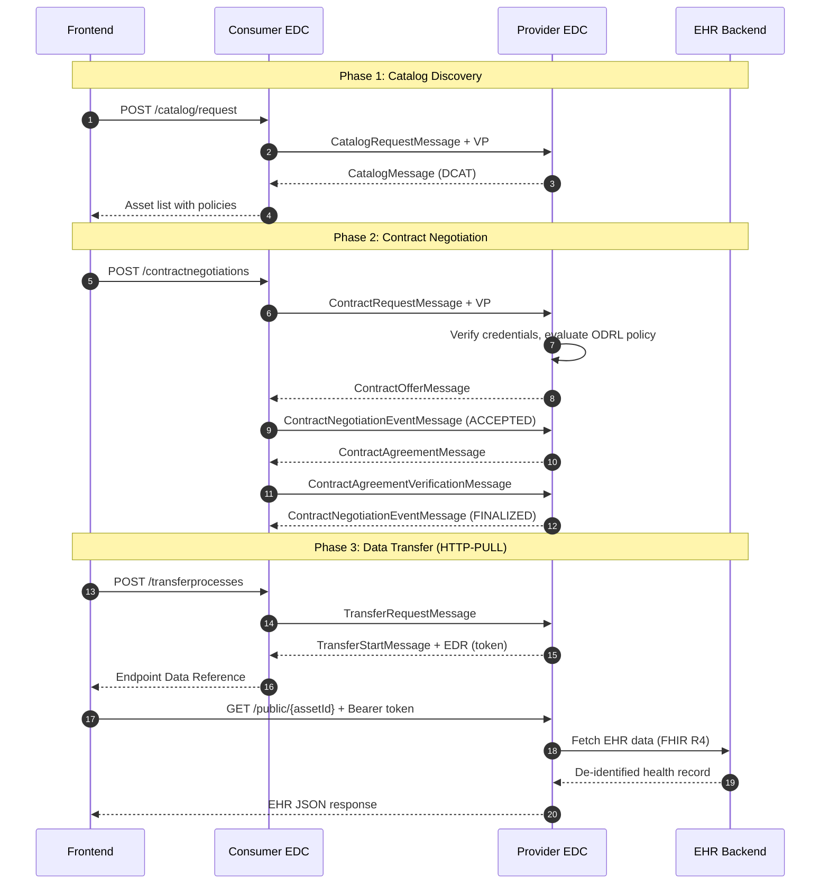
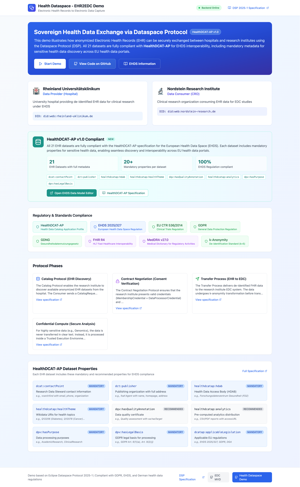

# Health Data Exchange with High Privacy and Consent Management Demo

[](https://eur-lex.europa.eu/eli/reg/2025/327)
[](https://healthdcat-ap.github.io/)
[](https://eclipse-dataspace-protocol-base.github.io/DataspaceProtocol/2025-1/)
[](https://eclipse-edc.github.io/docs/)

A comprehensive demonstration of secure, interoperable, and consent-managed access to health data for research (secondary use), aligned with the European Health Data Space (EHDS) and German Health Data Use Act (GDNG).

📚 **Documentation:**
- 📖 [**Implementation Plan**](docs/IMPLEMENTATION_PLAN.md) - Detailed step-by-step development guide from mock to production
- 👤 [**User Manual**](docs/USER-MANUAL.md) - End-user guide for browsing and accessing health data
- 🛠 [**Developer Manual**](docs/DEVELOPER-MANUAL.md) - Technical architecture and API reference

🐛 **Issue Tracking:**
- [#13 - Migrate to EDC Virtual-Connector for Multi-Tenancy](https://github.com/ma3u/MinimumViableDataspace/issues/13)
- [#10 - Phase 14: Monitoring & Debugging](https://github.com/ma3u/MinimumViableDataspace/issues/10)
- [#8 - Dataspace Insider View - Real-time DSP Protocol Visualization](https://github.com/ma3u/MinimumViableDataspace/issues/8)


## Purpose

This demo showcases how easy it is to create an **EHDS-compliant dataspace for health data** using the **Dataspace Protocol**. Built on **Eclipse Dataspace Components (EDC)**, it demonstrates:

- Secure, interoperable health data exchange aligned with the European Health Data Space (EHDS) regulation
- Consent-gated access using Verifiable Credentials and decentralized identity
- FHIR R4-compliant EHR data with clinical trial metadata, MedDRA classifications, and ADR tracking
- "Data Visiting" patterns for sensitive data (genomics, mental health) via Confidential Compute (DEMO ONLY)
- ODRL-based consent policies for fine-grained access control
- DCAT-AP for Health metadata for seamless data discovery and interoperability
- Flexible deployment modes: Mock backend, Hybrid EDC integration, Full EDC flow

🌐 **[Live Demo](https://ma3u.github.io/MinimumViableDataspace/)** (mock mode, no EDC required)


## Quick Start

### Deployment Options

The demo supports two deployment approaches:

| Deployment | Platform | Use Case | Setup Time |
|------------|----------|----------|------------|
| **Local Dev** | Node.js | Quick demos, frontend development | 2 min |
| **OrbStack Kubernetes** | OrbStack + Kubernetes | Full EDC stack with observability | 15 min |

### Three Operating Modes

Both deployment options support flexible operating modes:

| Mode | Backend | EDC Stack | Use Case |
|------|---------|-----------|----------|
| **mock** | Mock data in frontend | ❌ Not needed | Quick demo, frontend development |
| **hybrid** | backend-mock (FHIR) | ✅ Catalog only | Test EDC catalog integration |
| **full** | backend-mock + backend-edc | ✅ Complete flow | Full dataspace protocol, production-like |

---

### Option 1: OrbStack Kubernetes (Recommended)

**Production-like deployment with full EDC stack and observability**



**✅ Full EDC Stack + Observability Deployed** - Complete production-like EHDS dataspace on Kubernetes:

```bash
# Prerequisites: OrbStack installed with Kubernetes enabled

# 1. Build all Docker images (EDC components + applications)
./gradlew -Ppersistence=true build -x test  # Build EDC Java components
docker build -t health-ehr-backend:latest ./backend-mock
docker build -t health-frontend:latest ./frontend
docker build -t backend-edc:latest ./backend-edc

# 2. Deploy complete stack (19 components total)
kubectl apply -f deployment/k8s/00-namespace.yaml
kubectl apply -f deployment/k8s/infrastructure/      # PostgreSQL, Vault, DID server
kubectl apply -f deployment/k8s/application/         # Frontend, backends
kubectl apply -f deployment/k8s/edc-consumer/        # Consumer: controlplane, dataplane, identityhub
kubectl apply -f deployment/k8s/edc-provider/        # Provider: controlplane, dataplane, identityhub, catalog
kubectl apply -f deployment/k8s/trust-anchor/        # Issuer service
kubectl apply -f deployment/k8s/observability/       # Prometheus, Grafana, Jaeger, Loki

# 3. Create participants ConfigMap (required for EDC components)
kubectl create configmap participants-json \
  --from-file=participants.json=deployment/assets/participants/participants.k8s.json \
  -n health-dataspace

# 4. Set up port forwarding for all services
/tmp/port-forward-all.sh  # Script auto-generated during deployment

# 5. Seed the dataspace with credentials and health assets
./seed-dataspace.sh --mode=k8s --verbose

# 6. Access the demo
open http://localhost:3000              # Frontend
open http://localhost:3003              # Grafana (admin/dataspace)
open http://localhost:9090              # Prometheus
open http://localhost:16686             # Jaeger
```

**Management commands:**
```bash
# View all pods (19 components)
kubectl get pods -n health-dataspace

# Check EDC component status
kubectl get pods -n health-dataspace -l component=edc

# View logs from specific component
kubectl logs -n health-dataspace -l app=consumer-controlplane --tail=50
kubectl logs -n health-dataspace -l app=hospital-ehr-controlplane --tail=50

# View all EDC logs with pod prefixes
kubectl logs -n health-dataspace -l component=edc --tail=20 --prefix

# Check observability stack
kubectl get pods -n health-dataspace -l component=observability

# Restart specific deployment
kubectl rollout restart deployment/consumer-controlplane -n health-dataspace

# Clean up entire dataspace
kubectl delete namespace health-dataspace
```

**Deployed Components (19 total):**
- **Infrastructure (3)**: PostgreSQL, Vault, DID server
- **EDC Consumer (3)**: Control plane, data plane, identity hub
- **EDC Provider (4)**: Control plane, data plane, identity hub, catalog server
- **Trust Anchor (1)**: Issuer service for verifiable credentials
- **Application (3)**: Frontend, EHR backend, EDC proxy
- **Observability (5)**: Prometheus, Grafana, Jaeger, Loki, Promtail

📖 **Complete documentation:**
- [ORBSTACK-DEPLOYMENT.md](ORBSTACK-DEPLOYMENT.md) - Basic OrbStack setup
- [K8S-DEPLOYMENT-STATUS.md](K8S-DEPLOYMENT-STATUS.md) - Full deployment status and troubleshooting
- [deployment/k8s/README.md](deployment/k8s/README.md) - Kubernetes manifest details

---

### Option 2: Local Development (Mock Mode)

**Perfect for quick demos and frontend development** - no EDC required:

```bash
# Terminal 1: Start backend mock (FHIR R4 EHR data)
cd backend-mock
npm install
npm run dev:health

# Terminal 2: Start frontend
cd frontend
npm install
npm run dev
```

**Access the demo:**
```bash
open http://localhost:4000  # Frontend (local dev uses port 4000)
```

**Features in Mock Mode:**
- 20 synthetic EHR records (FHIR R4) with clinical trial metadata
- MedDRA v27.0 adverse event classifications
- GDPR Art. 89 compliant anonymization
- No EDC stack needed - instant startup
- Perfect for frontend development and demos

---

## API Endpoints

### OrbStack Kubernetes (Full EDC Mode)

**Application:**
- Frontend: http://localhost:3000
- EHR Backend: http://localhost:3001
- Backend EDC: http://localhost:3002

**EDC Management APIs:**
- Consumer Control Plane: http://localhost:8081
- Provider Control Plane: http://localhost:8191
- Issuer Service: http://localhost:10012
- Catalog Server: http://localhost:8091

**Observability:**
- Prometheus: http://localhost:9090
- Grafana: http://localhost:3003 (admin/dataspace)
- Jaeger: http://localhost:16686
- Loki: http://localhost:3100

### Local Development (Mock Mode)

- Frontend: http://localhost:4000
- EHR Backend API: http://localhost:3001/api/ehr

---

## Documentation

| Document | Description |
|----------|-------------|
| 📖 **[User Manual](docs/USER-MANUAL.md)** | Step-by-step guide for using the demo |
| 🔧 **[Developer Manual](docs/DEVELOPER-MANUAL.md)** | Architecture, APIs, and development guide |
| 🗺️ **[User Journey](docs/Health-EHR2EDC-UserJourney.md)** | Detailed EHR2EDC workflow documentation |

---

## Demo Scenario

The demo simulates secure health data exchange between:

- **Rheinland Universitätsklinikum** (Provider): Hospital holding patient EHR data
- **Nordstein Research Institute** (Consumer): CRO conducting clinical study
- **Patient**: Data subject who grants consent



---

## Architecture

### Service Ports

| Service | Port | Description |
|---------|------|-------------|
| Frontend | 3000 | React catalog browser |
| Backend-Mock | 3001 | Simulated FHIR backend |
| Backend-EDC | 3002 | EDC proxy service |
| Consumer EDC | 8081 | Consumer control plane |
| Provider EDC | 8191 | Provider control plane |
| Pact Broker | 9292 | Contract testing |

### Operating Modes

| Mode | Description | Use Case |
|------|-------------|----------|
| **Mock** | Direct mock data | Quick demos, offline |
| **Hybrid** | EDC catalog + mock data | Testing EDC integration |
| **Full** | Complete EDC flow | Production-like testing |

Configure via `VITE_API_MODE` environment variable.

---

## EDC Negotiation & Transfer Flow (DSP Protocol)

The Dataspace Protocol (DSP) defines how participants discover, negotiate, and transfer data. This demo implements the full DSP 2025 specification:



**Key DSP Messages:**

| Phase | Message | Direction | Purpose |
|-------|---------|-----------|---------|
| Catalog | `CatalogRequestMessage` | Consumer → Provider | Request available datasets |
| Catalog | `CatalogMessage` | Provider → Consumer | DCAT-AP catalog response |
| Negotiation | `ContractRequestMessage` | Consumer → Provider | Initiate negotiation with offer |
| Negotiation | `ContractAgreementMessage` | Provider → Consumer | Signed contract agreement |
| Transfer | `TransferRequestMessage` | Consumer → Provider | Request data transfer |
| Transfer | `TransferStartMessage` | Provider → Consumer | EDR with access token |

**Credential Verification:**
Each DSP message includes a Verifiable Presentation (VP) containing credentials issued by the dataspace authority. The provider verifies:
- `MembershipCredential` - Proves participant is a dataspace member
- `ConsentCredential` - Proves patient consent for data access (for health data)

---

## Key Features

- ✅ **EHDS Art. 51 Compliance** - Health categories and access rights
- ✅ **DCAT-AP for Health** - Metadata interoperability
- ✅ **FHIR R4** - ISiK and KBV profiles
- ✅ **Verifiable Credentials** - MembershipCredential, ConsentCredential
- ✅ **ODRL Policies** - Consent-based access control
- ✅ **Confidential Compute** - Data visiting for sensitive data
- ✅ **MedDRA v27.0** - Adverse event classification
- ✅ **Clinical Trial Phases** - Phase I-IV metadata

---
## Health Dataspace Demo - Startscreen



## Project Structure

```
MVD-health/
├── frontend/           # React frontend (port 3000)
├── backend-mock/       # Mock FHIR backend (port 3001)
├── backend-edc/        # EDC proxy service (port 3002)
├── extensions/         # Custom EDC extensions
├── launchers/          # EDC runtime configurations
├── database/           # Flyway migrations
├── specs/              # OpenAPI specifications
├── docs/               # Documentation
│   ├── USER-MANUAL.md
│   └── DEVELOPER-MANUAL.md
└── docker-compose.*.yml
```

---

## Development

```bash
# Build Java components
./gradlew build

# Run tests
./gradlew test
cd frontend && npm test

# Lint code
cd frontend && npm run lint
```

See [Developer Manual](docs/DEVELOPER-MANUAL.md) for detailed instructions.


## Standards & Compliance

| Standard | Implementation |
|----------|----------------|
| [EHDS Regulation (EU 2025/327)](https://eur-lex.europa.eu/eli/reg/2025/327) | Art. 50/51 categories, HDAB integration |
| [DCAT-AP for Health](https://healthdcat-ap.github.io/) | Full Release 5 compliance |
| [Dataspace Protocol](https://docs.internationaldataspaces.org/ids-knowledgebase/v/dataspace-protocol) | Catalog, negotiation, transfer |
| [FHIR R4](https://hl7.org/fhir/R4/) | Patient, Condition, Observation resources |
| [MedDRA v27.0](https://www.meddra.org/) | SOC/PT classification |
| [W3C Verifiable Credentials](https://www.w3.org/TR/vc-data-model/) | Consent and membership credentials |
| [ODRL](https://www.w3.org/TR/odrl-model/) | Access control policies |

---

## Roadmap

🚀 **[EDC Virtual-Connector Migration](https://github.com/ma3u/MinimumViableDataspace/issues/13)** - Multi-tenancy support for 80% cost reduction at scale (100+ hospitals).

See [docs/issues/](docs/issues/) for detailed planning documents.

---

## License

This project is licensed under the Apache License, Version 2.0. See [LICENSE](LICENSE) for details.

---

## Contributing

1. Fork the repository with the branch health-demo:  https://github.com/ma3u/MinimumViableDataspace/tree/health-demo
2. Create a feature branch
3. Make your changes
4. Run tests: `./gradlew test && cd frontend && npm test`
5. Submit a pull request

See [Developer Manual](docs/DEVELOPER-MANUAL.md) for coding guidelines.
