# EHR2EDC Developer Manual

Comprehensive technical documentation for the Health Dataspace Demo, including architecture, data flows, and integration guides.

---

## Table of Contents

1. [Architecture Overview](#1-architecture-overview)
2. [Component Architecture](#2-component-architecture)
3. [Data Flow Diagrams](#3-data-flow-diagrams)
4. [API Reference](#4-api-reference)
5. [EDC Integration](#5-edc-integration)
6. [Database Schema](#6-database-schema)
7. [Security & Identity](#7-security--identity)
8. [Development Guide](#8-development-guide)
9. [Testing Strategy](#9-testing-strategy)
10. [Deployment](#10-deployment)
11. [Troubleshooting](#11-troubleshooting)
12. [Screenshots & Demo Flow](#12-screenshots--demo-flow)

---

## 1. Architecture Overview

This chapter provides a high-level view of the Health Dataspace Demo system architecture. It covers the system context showing how external actors and systems interact with the demo, the internal component structure, and the network port allocation for all services. Understanding this architecture is essential for developers extending the system or debugging integration issues.

### System Context

The System Context diagram illustrates the boundaries of the Health Dataspace Demo and its relationships with external actors and systems. Patients interact via DID wallets to grant consent, while researchers access the web interface to browse and request health data. The system connects to external EHR systems (FHIR R4) and identity providers for credential verification.

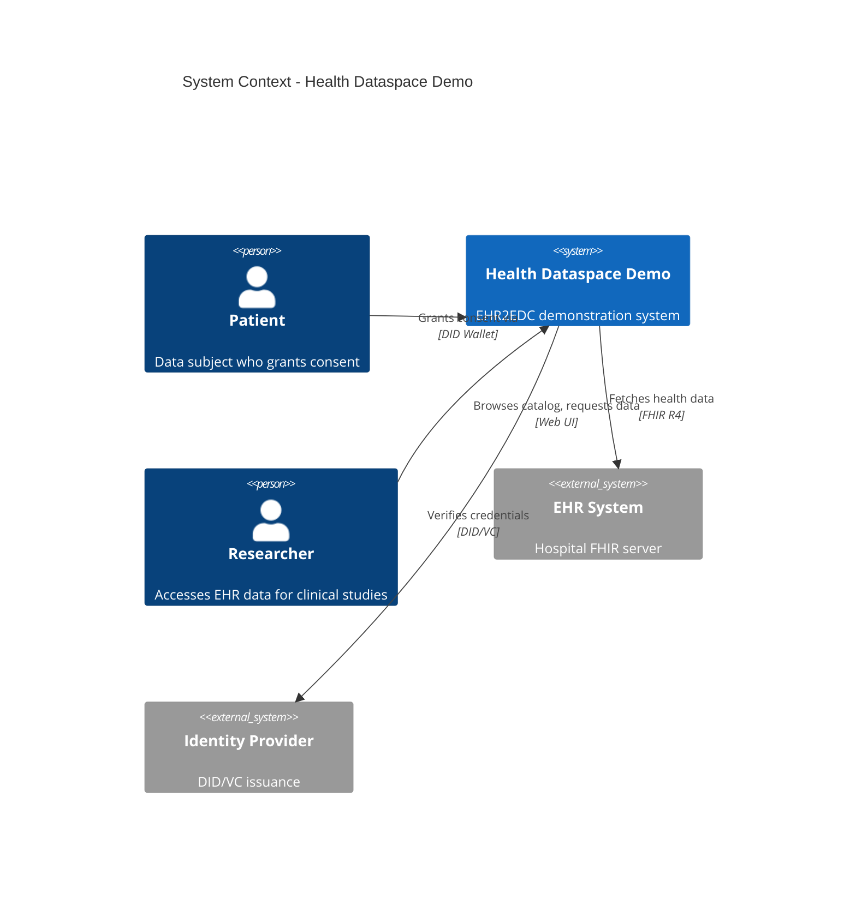

### High-Level Architecture

The High-Level Architecture diagram shows the layered structure of the system, from the user-facing frontend through the backend services to the EDC infrastructure. The frontend communicates with both the mock backend (for development) and the EDC backend (for production flows). All EDC components are interconnected via the Dataspace Protocol (DSP) and DIDComm for secure credential exchange.

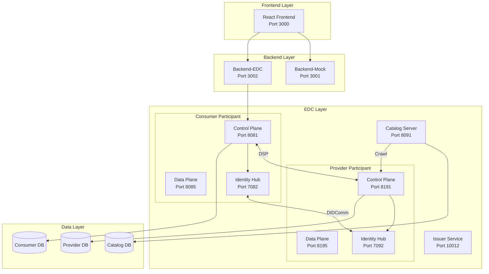

### Port Allocation

The following table documents all network ports used by the demo services. **Local development (Option A)** uses ports 4000-4001 to avoid conflicts with Docker. **Docker deployment (Option B)** uses ports 3000-3002. Both can run simultaneously.

| Service | Local (Option A) | Docker (Option B) | Description |
|---------|------------------|-------------------|-------------|
| Frontend | 4000 | 3000 | React Vite dev server |
| Backend-Mock | 4001 | 3001 | Simulated FHIR backend |
| Backend-EDC | - | 3002 | EDC proxy service |
| Consumer Control Plane | - | 8081-8084 | Management, DSP, Control, Public |
| Consumer Data Plane | - | 8085-8086 | Default, Public |
| Consumer Identity Hub | - | 7080-7083 | Presentation, STS, Identity, DID |
| Provider Control Plane | - | 8191-8194 | Management, DSP, Control, Public |
| Provider Data Plane | - | 8195-8196 | Default, Public |
| Provider Identity Hub | - | 7090-7093 | Presentation, STS, Identity, DID |
| Catalog Server | - | 8091-8092 | Default, Query |
| Issuer Service | - | 10010-10012 | Default, Admin, Issuance |
| Pact Broker | - | 9292 | Contract testing |

---

## 2. Component Architecture

This chapter details the internal structure of each major component in the system. Understanding these architectures helps developers navigate the codebase, add new features, and maintain existing functionality. Each component follows established patterns for its technology stack.

### Frontend (React + TypeScript)

The frontend is a single-page React application built with TypeScript and Vite. It uses a component-based architecture with clear separation between UI components, API services, and type definitions. The `apiFactory` pattern enables seamless switching between mock, hybrid, and full EDC modes without code changes.

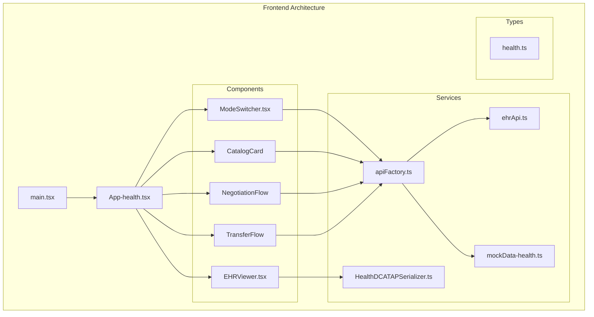

### Backend-EDC (Node.js + Express)

The Backend-EDC service acts as a middleware layer between the frontend and the EDC Control Plane. It simplifies the complex EDC APIs into RESTful endpoints that the frontend can easily consume. The service handles authentication, request transformation, and response mapping, abstracting away the JSON-LD complexity from the UI layer.

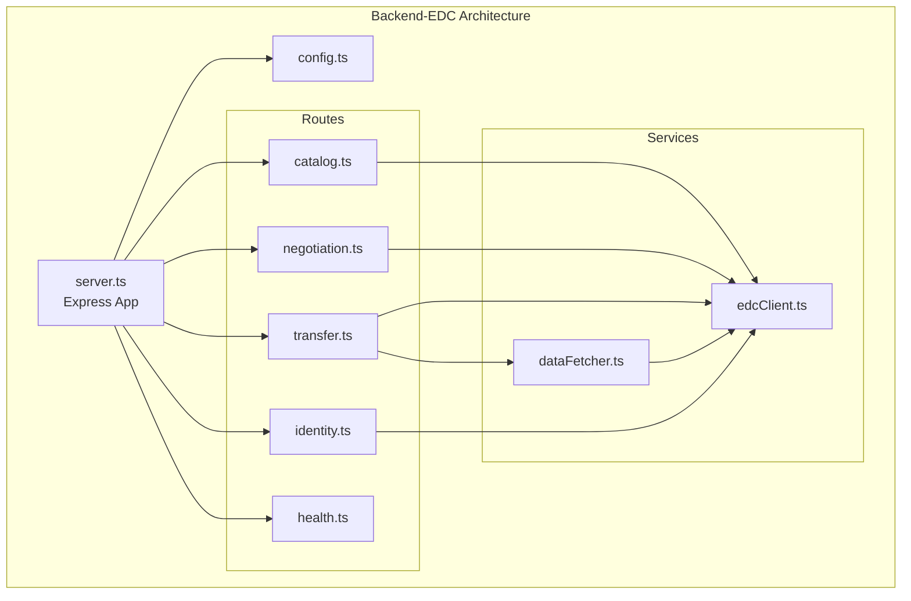

### EDC Extensions

The EDC framework is extended through custom Java extensions that add health-specific functionality. These extensions integrate with the EDC runtime via the Service Provider Interface (SPI) pattern. The `dcp-impl` extension implements the Decentralized Claims Protocol, while `catalog-node-resolver` enables dynamic discovery of federated catalog nodes.

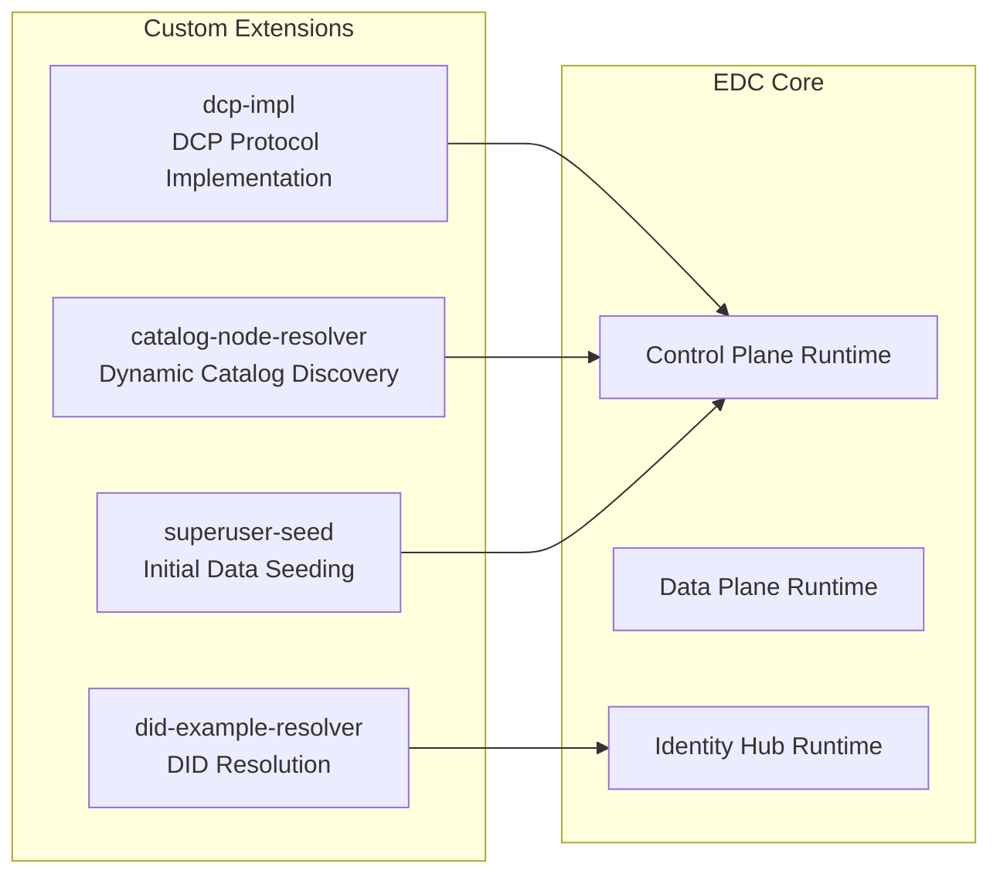

---

## 3. Data Flow Diagrams

This chapter provides detailed sequence diagrams showing how data flows through the system in different scenarios. These diagrams are essential for understanding the complete request lifecycle, debugging integration issues, and implementing new features. Each flow is color-coded by phase for easier comprehension.

### Complete EHR2EDC Flow (Full EDC Mode)

This sequence diagram shows the complete end-to-end flow when operating in full EDC mode. The flow is divided into three phases: Catalog Discovery (gray), Contract Negotiation (amber), and Data Transfer (green). Each phase involves multiple components and demonstrates the secure, consent-verified data exchange process that makes dataspaces trustworthy.

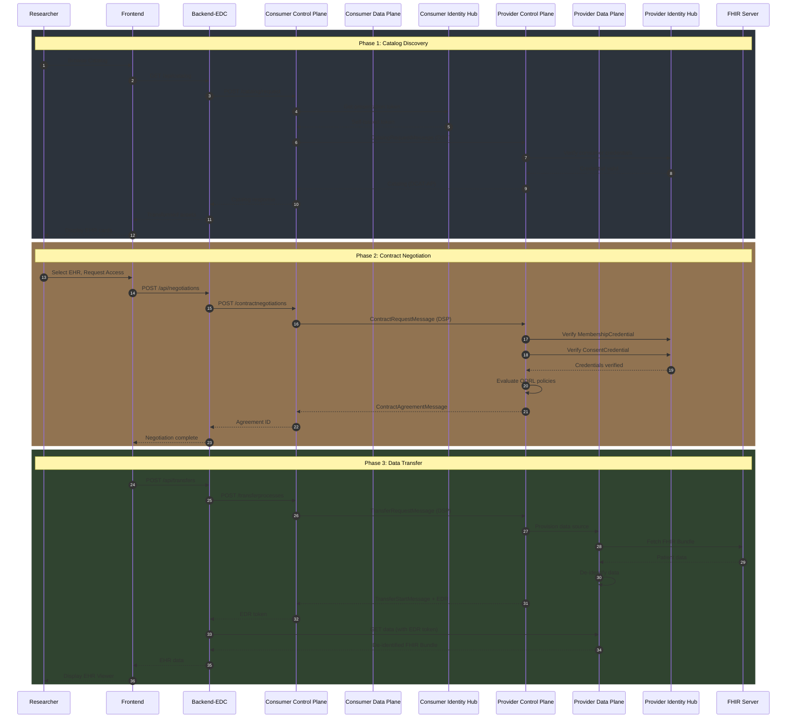

### Hybrid Mode Flow

Hybrid mode combines EDC catalog discovery with direct mock backend data access, enabling rapid development and testing. This mode is useful when you want to test catalog browsing and contract negotiation without the complexity of full data plane transfers. The catalog comes from the real EDC infrastructure, but data fetching bypasses the transfer process.

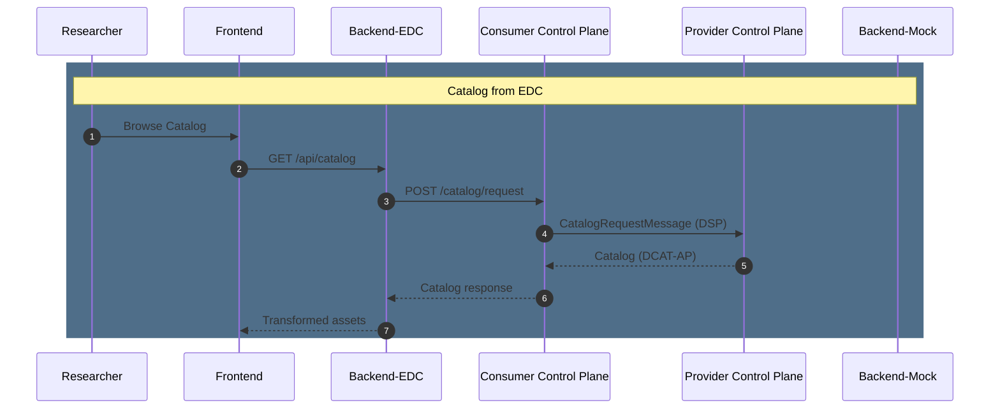

### Consent Verification Flow

This diagram details how consent is verified during contract negotiation. The Provider's Identity Hub validates the consumer's Verifiable Presentation, checks cryptographic signatures, resolves the issuer's DID, and ensures credentials are not revoked. Only after successful verification does ODRL policy evaluation proceed, ensuring data access is always consent-gated.

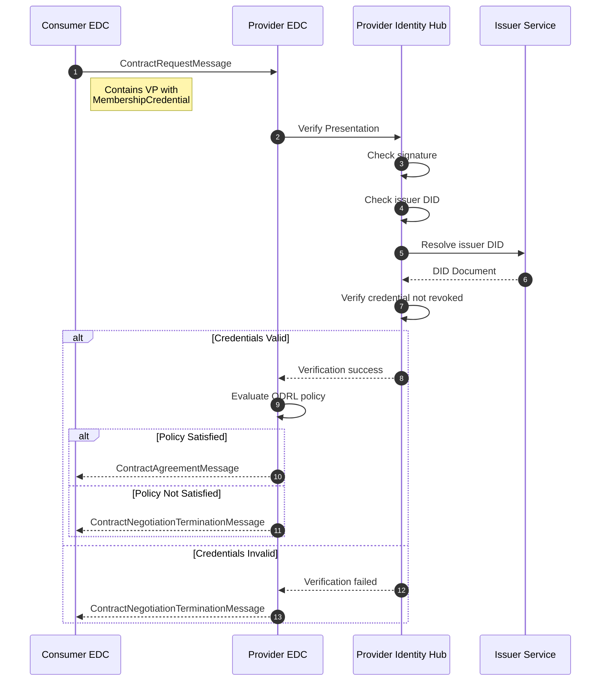

### ODRL Policy Evaluation

The ODRL (Open Digital Rights Language) policy evaluation flowchart shows the decision tree for granting or denying data access. Policies are evaluated in order: first membership credentials, then consent credentials, and finally data sensitivity checks. Sensitive data may require confidential compute policies, restricting access to compute-to-data scenarios only.

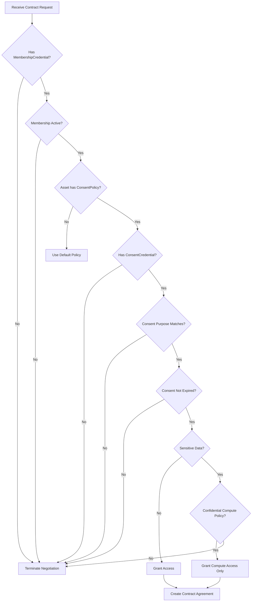

---

## 4. API Reference

This chapter documents all REST APIs exposed by the system components. The Backend-EDC API provides a simplified interface for frontend integration, while the EDC Management APIs offer full control over assets, policies, and transfers. All examples include curl commands that can be executed directly from the terminal.

### Backend-EDC API (Port 3002)

The Backend-EDC service exposes a RESTful API on port 3002 that abstracts the complexity of EDC interactions. All endpoints return JSON responses and accept JSON request bodies where applicable. Error responses follow a consistent format with status codes and descriptive messages.

#### Health Endpoints

Health endpoints enable monitoring and orchestration tools to verify service availability. The `/health/detailed` endpoint provides dependency status for troubleshooting, while `/health/ready` and `/health/live` support Kubernetes probe configurations.

| Method | Path | Description |
|--------|------|-------------|
| GET | `/health` | Basic health check |
| GET | `/health/detailed` | Detailed status with dependencies |
| GET | `/health/ready` | Kubernetes readiness probe |
| GET | `/health/live` | Kubernetes liveness probe |

#### Catalog Endpoints

Catalog endpoints handle data asset discovery from the federated catalog. The primary endpoint requests the catalog from the provider's DSP endpoint and transforms the DCAT-AP response into a frontend-friendly format. Cached endpoints can improve performance by avoiding repeated DSP requests.

| Method | Path | Description |
|--------|------|-------------|
| GET | `/api/catalog` | Request catalog from provider |
| GET | `/api/catalog/assets` | Get transformed catalog assets |
| GET | `/api/catalog/cached` | Query federated catalog cache |

**Example: Request Catalog**
```bash
curl http://localhost:3002/api/catalog
```

**Response:**
```json
{
  "@context": ["https://w3id.org/dcat/"],
  "@type": "dcat:Catalog",
  "dcat:dataset": [
    {
      "@id": "ehr:EHR001",
      "dct:title": "EHR001 - Hypertensive Heart Disease",
      "healthdcatap:healthCategory": "Cardiology",
      "healthdcatap:ageRange": "45-54"
    }
  ]
}
```

#### Negotiation Endpoints

Negotiation endpoints manage the contract negotiation lifecycle with the provider. Negotiations are asynchronous—after initiating, you must poll for state changes until reaching a terminal state (FINALIZED or TERMINATED). The agreement endpoint retrieves the signed contract after successful negotiation.

| Method | Path | Description |
|--------|------|-------------|
| POST | `/api/negotiations` | Initiate contract negotiation |
| GET | `/api/negotiations` | List all negotiations |
| GET | `/api/negotiations/:id` | Get negotiation status |
| POST | `/api/negotiations/:id/poll` | Poll until terminal state |
| GET | `/api/negotiations/:id/agreement` | Get contract agreement |

**Example: Initiate Negotiation**
```bash
curl -X POST http://localhost:3002/api/negotiations \
  -H "Content-Type: application/json" \
  -d '{
    "assetId": "ehr:EHR001",
    "offerId": "offer:EHR001:policy:membership",
    "policyId": "policy:membership"
  }'
```

**Response:**
```json
{
  "negotiationId": "urn:uuid:abc123",
  "state": "REQUESTED",
  "message": "Negotiation initiated"
}
```

#### Transfer Endpoints

Transfer endpoints handle the secure data exchange process after contract agreement. Like negotiations, transfers are asynchronous and require polling. The EDR (Endpoint Data Reference) provides a short-lived token for authenticated data access, which the `/data` endpoint uses to fetch the actual EHR records.

| Method | Path | Description |
|--------|------|-------------|
| POST | `/api/transfers` | Initiate data transfer |
| GET | `/api/transfers` | List all transfers |
| GET | `/api/transfers/:id` | Get transfer status |
| POST | `/api/transfers/:id/poll` | Poll until terminal state |
| GET | `/api/transfers/:id/edr` | Get Endpoint Data Reference |
| GET | `/api/transfers/:id/data` | Fetch data via EDR |
| GET | `/api/transfers/ehr/:id` | Mode-aware EHR fetch |
| POST | `/api/transfers/ehr/:id/transfer` | Full EDC transfer for EHR |

#### Identity Endpoints

Identity endpoints manage participant identity, verifiable credentials, and consent attestations. These endpoints integrate with the EDC Identity Hub to issue and verify credentials. The consent endpoints allow patients to grant, check, and revoke access to their health data for specific studies.

| Method | Path | Description |
|--------|------|-------------|
| GET | `/api/identity/participant` | Get participant info |
| GET | `/api/identity/credentials` | List verifiable credentials |
| POST | `/api/identity/attestation/membership` | Submit membership attestation |
| POST | `/api/identity/attestation/consent` | Submit consent attestation |
| GET | `/api/identity/consent/:patientDid` | Check consent status |
| POST | `/api/identity/consent/:patientDid/revoke` | Revoke consent |

### EDC Management API (Ports 8081/8191)

The EDC Management API provides direct access to the connector's internal state and configuration. This API is used for administrative tasks like creating assets, defining policies, and monitoring transfers. Consumer operations use port 8081, while provider operations use port 8191.

All requests require header: `X-Api-Key: password`

#### Assets

Assets represent data offerings in the catalog. Each asset has properties (metadata) and a data address (location). The data address tells the data plane where to fetch the actual data when a transfer is initiated.

```bash
# List assets
curl -X POST http://localhost:8191/api/management/v3/assets/request \
  -H "X-Api-Key: password" \
  -H "Content-Type: application/json" \
  -d '{"offset": 0, "limit": 10}'

# Create asset
curl -X POST http://localhost:8191/api/management/v3/assets \
  -H "X-Api-Key: password" \
  -H "Content-Type: application/json" \
  -d '{
    "@context": {"edc": "https://w3id.org/edc/v0.0.1/ns/"},
    "@id": "ehr:EHR001",
    "properties": {
      "name": "EHR001",
      "healthdcatap:healthCategory": "Cardiology"
    },
    "dataAddress": {
      "type": "HttpData",
      "baseUrl": "http://backend-mock:3001/api/ehr/EHR001"
    }
  }'
```

#### Policies

Policies define the access control rules for assets using ODRL (Open Digital Rights Language). Policies are linked to assets via contract definitions, which combine an asset selector with access and contract policies. The constraint-based model allows expressing complex rules like "requires active membership AND valid consent."

```bash
# Create policy
curl -X POST http://localhost:8191/api/management/v3/policydefinitions \
  -H "X-Api-Key: password" \
  -H "Content-Type: application/json" \
  -d '{
    "@context": {"edc": "https://w3id.org/edc/v0.0.1/ns/"},
    "@id": "policy:membership",
    "policy": {
      "@type": "Set",
      "permission": [{
        "action": "use",
        "constraint": [{
          "leftOperand": "MembershipCredential",
          "operator": "eq",
          "rightOperand": "active"
        }]
      }]
    }
  }'
```

### OpenAPI Specifications

The `specs/` directory contains formal API specifications that define the contracts between system components. These OpenAPI 3.1 documents serve as the source of truth for API shapes and enable automated testing, client generation, and documentation.

| Specification | Description | Servers |
|---------------|-------------|---------|
| [edc-management-api.yaml](../specs/edc-management-api.yaml) | EDC Management API v3 with HealthDCAT-AP extensions | Consumer `:8081`, Provider `:8191` |
| [ehr-health-api.yaml](../specs/ehr-health-api.yaml) | EHR Backend API with FHIR R4 schemas | Mock `:3001`, EDC `:3002` |
| [identity-hub-api.yaml](../specs/identity-hub-api.yaml) | Identity Hub API for DID/VC management | Consumer `:7082`, Provider `:7092` |

**Key Schema Definitions:**

```yaml
# From edc-management-api.yaml
AssetProperties:
  healthdcatap:healthCategory     # Health category URI
  healthdcatap:ageRange           # Age band (e.g., 55-64)
  healthdcatap:clinicalTrialPhase # Phase I-IV
  healthdcatap:meddraVersion      # MedDRA version (e.g., 27.0)
  healthdcatap:sensitiveCategory  # standard, mental-health, hiv, genomics

# From ehr-health-api.yaml
EHRCatalogSummary:
  ehrId, assetId, diagnosis, ageBand, biologicalSex
  icdCode, clinicalPhase, medDRASOC, sensitiveCategory
```

#### ODRL Policy Schemas

The `specs/odrl-policies/` directory contains JSON Schema definitions for ODRL policies used in the health demo. These schemas validate policy structure before registration and document the expected constraint patterns.

| Policy Schema | Purpose | Key Constraints |
|--------------|---------|-----------------|
| [health-membership-policy.schema.json](../specs/odrl-policies/health-membership-policy.schema.json) | Dataspace membership verification | `MembershipCredential eq active` |
| [health-consent-policy.schema.json](../specs/odrl-policies/health-consent-policy.schema.json) | Patient consent validation | `DataAccess.level`, prohibits re-identification |
| [health-sensitive-policy.schema.json](../specs/odrl-policies/health-sensitive-policy.schema.json) | GDPR Art. 9 special category data | `dpv:SpecialCategoryPersonalData` |
| [health-confidential-compute-policy.schema.json](../specs/odrl-policies/health-confidential-compute-policy.schema.json) | TEE/Confidential computing | `Security.confidentialComputing eq required` |

**Using Schemas for Validation:**

```bash
# Validate a policy against schema using ajv-cli
npm install -g ajv-cli ajv-formats
ajv validate -s specs/odrl-policies/health-consent-policy.schema.json \
  -d your-policy.json --all-errors
```

**Generating TypeScript Types:**

```bash
# Generate types from OpenAPI specs using openapi-typescript
npm install -D openapi-typescript
npx openapi-typescript specs/edc-management-api.yaml -o frontend/src/types/edc-api.d.ts
npx openapi-typescript specs/ehr-health-api.yaml -o frontend/src/types/ehr-api.d.ts
```

---

## 5. EDC Integration

This chapter covers the technical details of integrating with Eclipse Dataspace Components (EDC). Understanding JSON-LD contexts, state machines, and protocol flows is essential for debugging issues and extending functionality. The EDC uses the Dataspace Protocol (DSP) for inter-connector communication.

### JSON-LD Context

JSON-LD (JavaScript Object Notation for Linked Data) is used throughout the EDC APIs to provide semantic meaning to data. Each context URL defines vocabulary terms and their IRIs. Incorrect or missing contexts cause request parsing failures, so always include the appropriate contexts for your payloads.

All EDC API requests use JSON-LD context:

```typescript
export const EDC_CONTEXT = ['https://w3id.org/edc/connector/management/v0.0.1'];
export const ODRL_CONTEXT = 'http://www.w3.org/ns/odrl.jsonld';
export const DCAT_CONTEXT = 'https://www.w3.org/ns/dcat/';
export const HEALTHDCAT_CONTEXT = 'https://healthdcat-ap.eu/ns/';
```

### Catalog Request Flow

This state diagram shows the lifecycle of a catalog request from initiation to completion. The flow is synchronous from the caller's perspective but involves asynchronous DSP messaging between connectors. Timeouts during the waiting state indicate network issues or provider unavailability.

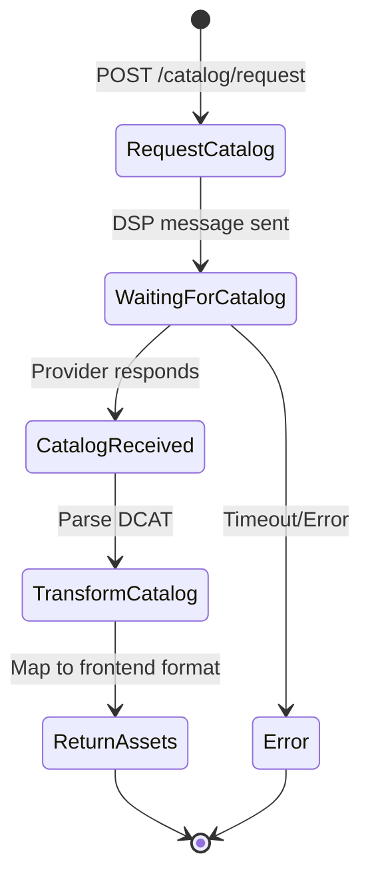

### Contract Negotiation State Machine

The contract negotiation follows a formal state machine defined by the Dataspace Protocol specification. States progress from INITIAL through various phases until reaching either FINALIZED (success) or TERMINATED (failure). Understanding these states is crucial for implementing retry logic and handling edge cases in the UI.

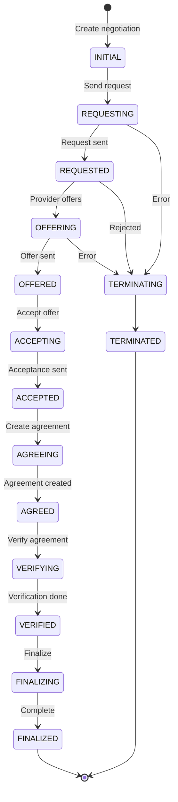

### Transfer Process State Machine

The transfer process state machine manages the complete data transfer lifecycle including provisioning, data exchange, and cleanup. Transfers can be suspended and resumed, supporting long-running or interruptible operations. The DEPROVISIONING phase ensures resources are properly released after completion.

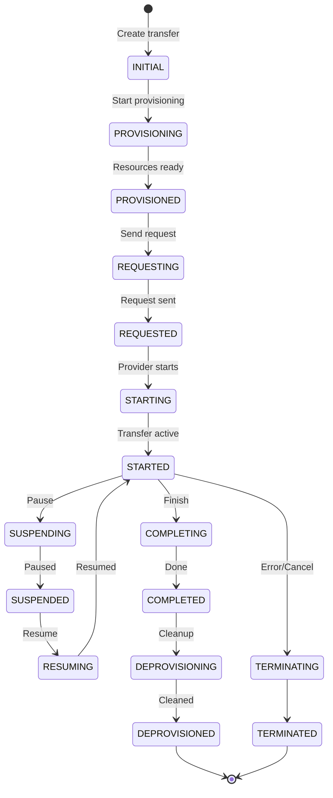

---

## 6. Database Schema

This chapter documents the database schema used by the health demo extensions. The schema stores membership attestations, consent records, access logs, and audit trails. Flyway manages database migrations, ensuring schema consistency across environments and enabling safe evolution of the data model.

### Flyway Migrations

Flyway is a database migration tool that applies versioned SQL scripts to evolve the schema. Migration files follow the naming convention `V{version}__{description}.sql` and are applied in order. The schema info table tracks which migrations have been applied. Never modify applied migrations—create new ones instead.

Migrations are in `database/src/main/resources/db/migration/`:

The entity-relationship diagram below shows the core tables and their relationships. The `membership_attestations` table stores organization credentials, while `consent_attestations` tracks patient consent grants. Both tables link to `health_data_access_logs` for complete audit trails. The `audit_trail` table provides tamper-evident logging with hash chains.

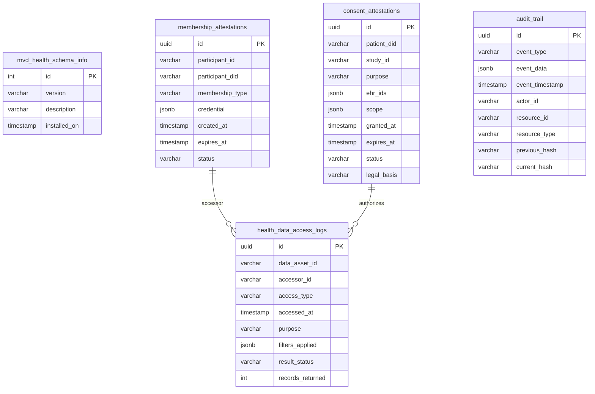

### Running Migrations

The following Gradle commands manage database migrations. Always run `flywayInfo` first to check the current state before applying migrations. The `flywayClean` command drops all objects—use with extreme caution in non-development environments.

```bash
# Run all migrations
./gradlew :database:flywayMigrate

# Check migration status
./gradlew :database:flywayInfo

# Clean database (caution!)
./gradlew :database:flywayClean
```

---

## 7. Security & Identity

This chapter covers the decentralized identity infrastructure that enables trust in the dataspace. The system uses W3C Decentralized Identifiers (DIDs) for participant identification and Verifiable Credentials (VCs) for attestations. This architecture eliminates central identity authorities while enabling cryptographically verifiable claims.

### DID Architecture

The DID architecture diagram shows how different DID methods, credentials, and participants relate. The dataspace uses `did:web` for organizational identities and `did:key` for lightweight patient identities. Credentials are issued by trusted parties and held by subjects who present them during authorization decisions.

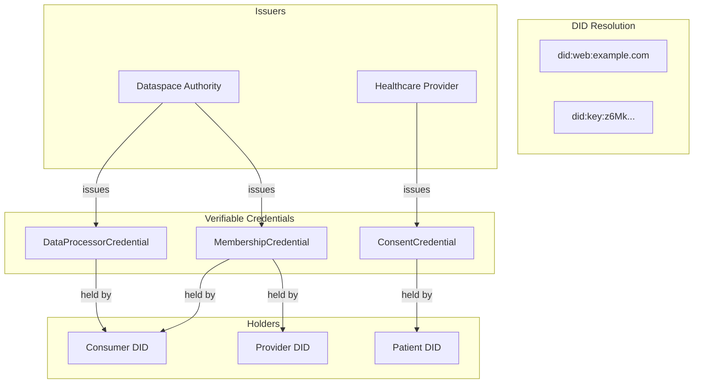

### Credential Schema

Verifiable Credentials follow the W3C VC Data Model and contain claims about subjects signed by issuers. The `MembershipCredential` proves participation in the dataspace, while `ConsentCredential` captures patient consent for specific data use. Credentials include validity periods and can be revoked by issuers if needed.

**MembershipCredential:**
```json
{
  "@context": ["https://www.w3.org/2018/credentials/v1"],
  "type": ["VerifiableCredential", "MembershipCredential"],
  "issuer": "did:web:dataspace-authority.eu",
  "credentialSubject": {
    "id": "did:web:consumer.example.com",
    "memberOf": "HealthDataSpace",
    "membershipType": "full",
    "validFrom": "2024-01-01T00:00:00Z",
    "validUntil": "2025-01-01T00:00:00Z"
  }
}
```

**ConsentCredential:**
```json
{
  "@context": [
    "https://www.w3.org/2018/credentials/v1",
    "https://ehds.europa.eu/credentials/v1"
  ],
  "type": ["VerifiableCredential", "ConsentCredential"],
  "issuer": "did:web:hospital.example.com",
  "credentialSubject": {
    "id": "did:key:z6MkPatient...",
    "consentType": "research",
    "purpose": "clinical-trial",
    "studyId": "STUDY-2024-001",
    "scope": {
      "demographics": true,
      "diagnosis": true,
      "medications": true,
      "genomics": false
    },
    "legalBasis": "EHDS-Art41",
    "validUntil": "2025-12-31T23:59:59Z"
  }
}
```

---

## 8. Development Guide

This chapter provides practical guidance for developers working on the Health Dataspace Demo. It covers project structure, local development setup, and common extension scenarios. Following these patterns ensures consistency across the codebase and reduces onboarding time for new contributors.

### Project Structure

The monorepo contains multiple packages organized by technology and function. Frontend and backend TypeScript code lives in their respective directories, while Java EDC extensions are under `extensions/`. The `launchers/` directory contains the runtime entry points that assemble extensions into executable services.

```
MVD-health/
├── frontend/                 # React frontend
│   ├── src/
│   │   ├── App-health.tsx   # Main app component
│   │   ├── components/      # UI components
│   │   ├── services/        # API services
│   │   └── types/           # TypeScript types
│   └── package.json
│
├── backend-mock/            # Mock FHIR backend
│   ├── src/
│   │   └── server-health.ts # Express server
│   └── package.json
│
├── backend-edc/             # EDC proxy backend
│   ├── src/
│   │   ├── server.ts        # Express server
│   │   ├── config.ts        # Configuration
│   │   ├── routes/          # API routes
│   │   └── services/        # EDC client
│   └── package.json
│
├── extensions/              # Custom EDC extensions
│   ├── dcp-impl/
│   ├── catalog-node-resolver/
│   ├── did-example-resolver/
│   └── superuser-seed/
│
├── launchers/              # EDC runtime launchers
│   ├── controlplane/
│   ├── dataplane/
│   ├── identity-hub/
│   ├── catalog-server/
│   └── issuerservice/
│
├── database/               # Flyway migrations
│   └── src/main/resources/db/migration/
│
├── specs/                  # OpenAPI specifications
│   ├── edc-management-api.yaml
│   ├── identity-hub-api.yaml
│   └── ehr-health-api.yaml
│
├── docker-compose.health.yml    # Basic services
├── docker-compose.edc.yml       # Full EDC stack
└── seed-health.sh              # Data seeding script
```

### Local Development Setup

Follow these steps to set up your local development environment. **Option A (local)** and **Option B (Docker)** can run simultaneously on different ports. Mock mode requires only Node.js, while full mode additionally needs Docker and Java.

```bash
# 1. Clone and install
git clone <repo>
cd MVD-health

# 2. Build Java components (requires persistence flag for Docker/Vault support)
./gradlew -Ppersistence=true build -x test

# 3. Install Node dependencies
cd frontend && npm install && cd ..
cd backend-mock && npm install && cd ..
cd backend-edc && npm install && cd ..

# 4. Start services (can run both simultaneously)

# Option A: Local mock mode (ports 4000/4001)
cd backend-mock && npm run dev:local &  # Port 4001
cd frontend && npm run dev:local  # Port 4000
# Open http://localhost:4000

# Option B: Full EDC stack (ports 3000/3001/3002)
docker-compose -f docker-compose.health.yml -f docker-compose.edc.yml up -d
# Seed the dataspace (recommended unified script)
./seed-dataspace.sh --mode=docker
cd frontend && cp .env.full .env.local && npm run dev  # Port 3000
# Open http://localhost:3000
```

### Adding a New EHR Record

To add a new patient EHR record to the demo, you need to update both the mock backend (data source) and the seed script (catalog registration). The record must include all required FHIR fields and HealthDCAT-AP metadata. After adding, restart the backend and re-run the seed script.

1. Add to `backend-mock/src/server-health.ts`:
```typescript
const ehrRecords = {
  // ... existing records
  'EHR021': {
    credentialSubject: {
      ehrId: 'EHR021',
      diagnosis: 'New Condition',
      diagnosisCode: 'J00',
      // ...
    }
  }
};
```

2. Add to catalog in `seed-health.sh`:
```bash
curl -X POST "$PROVIDER_MANAGEMENT/assets" \
  -H "X-Api-Key: $API_KEY" \
  -H "Content-Type: application/json" \
  -d '{
    "@context": {"edc": "https://w3id.org/edc/v0.0.1/ns/"},
    "@id": "ehr:EHR021",
    "properties": { ... },
    "dataAddress": {
      "type": "HttpData",
      "baseUrl": "'$EHR_BACKEND_URL'/api/ehr/EHR021"
    }
  }'
```

### Adding a New ODRL Policy

ODRL policies control access to assets through declarative rules. When adding a new policy, first define the JSON schema for validation, then create the policy in the seed script. Policies can reference credentials, time constraints, purpose limitations, and other access conditions supported by the policy engine.

1. Create schema in `specs/odrl-policies/`:
```json
{
  "$schema": "http://json-schema.org/draft-07/schema#",
  "$id": "health-new-policy.schema.json",
  "title": "New Health Policy",
  "type": "object",
  "properties": {
    // ...
  }
}
```

2. Create policy in `seed-health.sh`:
```bash
curl -X POST "$PROVIDER_MANAGEMENT/policydefinitions" \
  -H "X-Api-Key: $API_KEY" \
  -H "Content-Type: application/json" \
  -d '{
    "@context": {"edc": "https://w3id.org/edc/v0.0.1/ns/"},
    "@id": "policy:new-policy",
    "policy": {
      "@type": "Set",
      "permission": [{ ... }]
    }
  }'
```

---

## 9. Testing Strategy

This chapter outlines the testing approach for the Health Dataspace Demo. The test suite follows the testing pyramid pattern, with many unit tests, fewer integration tests, and minimal end-to-end tests. Pact contract testing ensures API compatibility between services without requiring full integration environments.

### Test Pyramid

The test pyramid visualizes the recommended distribution of test types. Unit tests (bottom) are fast, isolated, and numerous. Integration tests (middle) verify component interactions using Pact contracts. E2E tests (top) are expensive but validate complete user journeys through the deployed system.

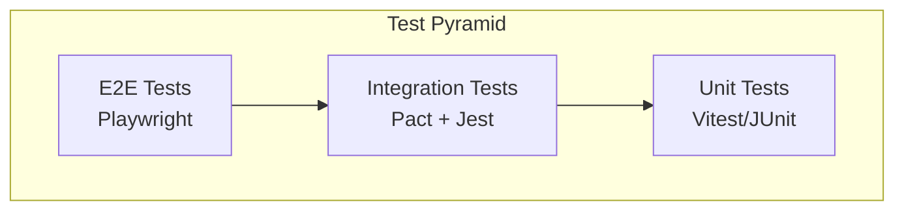

### Running Tests

The following commands run different test suites. Unit tests execute quickly and should be run frequently during development. Integration tests require the Pact Broker to be running. E2E and performance tests require the full Docker environment to be up.

```bash
# Unit tests (frontend)
cd frontend && npm test

# Unit tests (backend-edc)
cd backend-edc && npm test

# Unit tests (Java)
./gradlew test

# Integration tests (Pact)
cd frontend && npm run test:pact
cd backend-edc && npm run test:pact:verify

# E2E tests
./gradlew :tests:end2end:test

# Performance tests
./gradlew :tests:performance:test
```

### Pact Contract Testing

Pact is a consumer-driven contract testing framework that ensures API compatibility between services. The consumer (frontend) generates contracts based on expected interactions, publishes them to the broker, and the provider (backend-edc) verifies it can fulfill those contracts. This catches breaking changes before deployment.

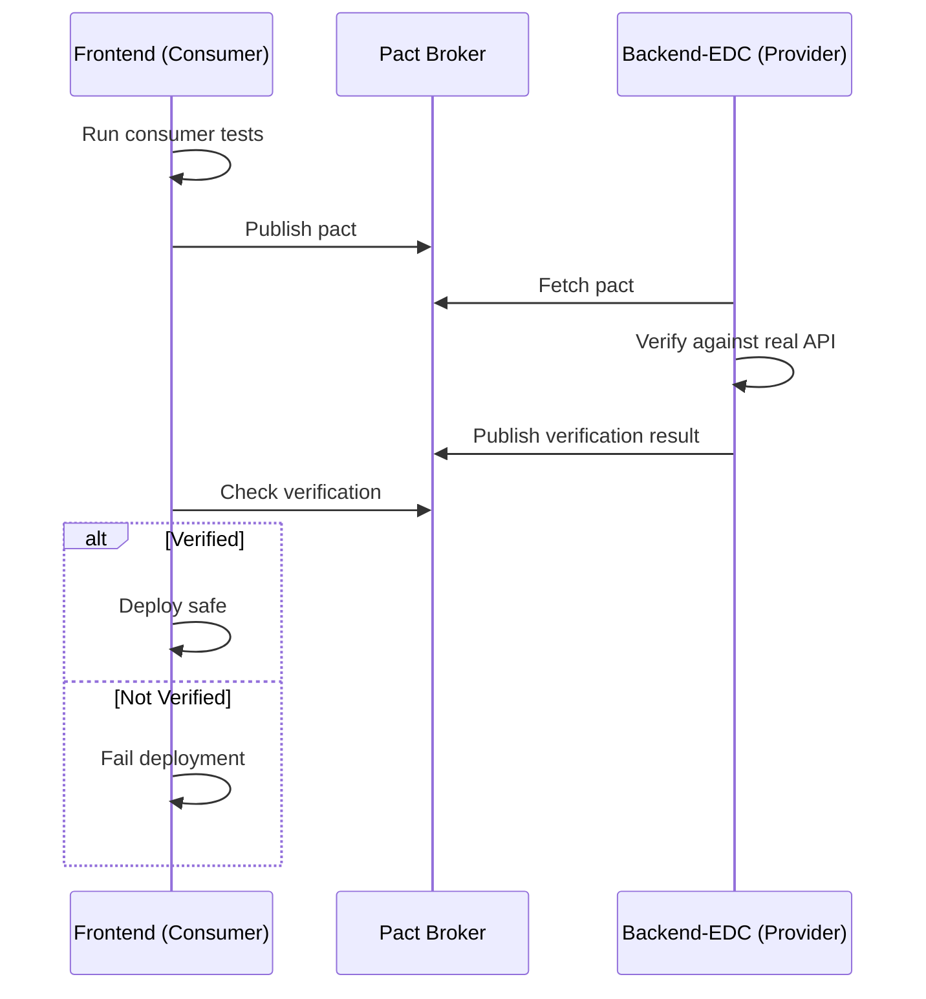

### OpenAPI Specification Testing

The OpenAPI specs in `specs/` directory enable contract-first testing. Use these specs to validate API responses, generate mock servers, and ensure frontend/backend compatibility.

**Validate API Responses Against Spec:**

```bash
# Install openapi-response-validator
npm install -D openapi-response-validator

# In tests, validate actual responses match spec
import { OpenAPIResponseValidator } from 'openapi-response-validator';
const spec = require('../../../specs/edc-management-api.yaml');
const validator = new OpenAPIResponseValidator({ responses: spec.paths['/assets']['post'].responses });
validator.validateResponse(201, actualResponse); // throws if invalid
```

**Generate Mock Servers from Specs:**

```bash
# Use Prism for spec-based mock server
npm install -g @stoplight/prism-cli
prism mock specs/ehr-health-api.yaml --port 4001

# All endpoints return valid mock data matching the spec
curl http://localhost:4001/api/ehr  # Returns mock EHR list
```

**ODRL Policy Validation:**

The ODRL policy schemas ensure policies conform to expected structure before registration:

```bash
# Validate policy before seeding
ajv validate -s specs/odrl-policies/health-consent-policy.schema.json \
  -d seed-policies/consent-policy.json --all-errors

# Example programmatic validation
import Ajv from 'ajv';
import consentSchema from '../specs/odrl-policies/health-consent-policy.schema.json';
const ajv = new Ajv();
const validate = ajv.compile(consentSchema);
if (!validate(policy)) console.error(validate.errors);
```

### Frontend Hook Tests

The custom React hooks for EDC integration have comprehensive unit tests covering:

| Test Category | Coverage | Key Tests |
|--------------|----------|-----------|
| **Error Handling** | ✅ | API failures, timeouts, invalid responses |
| **Retry Logic** | ✅ | Exponential backoff, configurable attempts |
| **State Management** | ✅ | DSP state machine transitions |
| **Memory Safety** | ✅ | Cleanup on unmount, polling cancellation |

```bash
# Run frontend hook tests
cd frontend && npm test

# Run with coverage
cd frontend && npx vitest --coverage --run
```

See [TEST_VERIFICATION_REPORT.md](../frontend/docs/TEST_VERIFICATION_REPORT.md) for detailed test results.

---

## 10. Deployment

This chapter covers deployment options for the Health Dataspace Demo. Docker Compose is recommended for local development and testing, while Kubernetes (via Terraform) is used for production deployments. Both environments use the same container images, ensuring consistency between development and production.

### Docker Compose (Development)

Docker Compose orchestrates all services locally using container definitions from the compose files. The health compose file provides basic services, while the EDC compose file adds the full connector infrastructure. Use the `--build` flag to rebuild images after code changes.

```bash
# Start all services
docker-compose -f docker-compose.health.yml -f docker-compose.edc.yml up --build

# View logs
docker-compose -f docker-compose.health.yml -f docker-compose.edc.yml logs -f

# Stop all services
docker-compose -f docker-compose.health.yml -f docker-compose.edc.yml down

# Clean volumes
docker-compose -f docker-compose.health.yml -f docker-compose.edc.yml down -v
```

### Kubernetes (Production)

Production deployment uses Terraform to provision Kubernetes resources. The Terraform modules in the `deployment/` directory define all required infrastructure including pods, services, ingresses, and secrets. Always run `terraform plan` before `apply` to review changes.

```bash
# Apply Terraform
cd deployment
terraform init
terraform plan
terraform apply

# Seed data
./seed-k8s.sh
```

### Environment Variables

The following environment variables configure the system behavior. These can be set in `.env` files for local development or as Kubernetes secrets for production. The `BACKEND_MODE` variable is particularly important as it controls whether the system uses mock data or real EDC transfers.

| Variable | Description | Default |
|----------|-------------|---------|
| `BACKEND_MODE` | `hybrid` or `full` | `hybrid` |
| `EDC_API_KEY` | API authentication key | `password` |
| `EDC_CONSUMER_MANAGEMENT_URL` | Consumer control plane | `http://localhost:8081/api/management/v3` |
| `EDC_PROVIDER_DSP_URL` | Provider DSP endpoint | `http://localhost:8192/api/dsp` |
| `BACKEND_MOCK_URL` | Mock backend URL | `http://localhost:3001` |

### Health Checks

Use these curl commands to verify that services are running and healthy. Run these checks after starting the stack to ensure all components are ready. Failed health checks indicate startup issues—check the Docker logs for the specific service that's failing.

```bash
# Frontend
curl http://localhost:3000

# Backend-Mock
curl http://localhost:3001/health

# Backend-EDC
curl http://localhost:3002/health/detailed

# Consumer Control Plane
curl -H "X-Api-Key: password" http://localhost:8081/api/management/v3/assets/request \
  -d '{"offset":0,"limit":1}'

# Provider Control Plane
curl -H "X-Api-Key: password" http://localhost:8191/api/management/v3/assets/request \
  -d '{"offset":0,"limit":1}'
```

---

## 11. Troubleshooting

This chapter provides solutions to common issues encountered during development and deployment.

### Port Conflicts

**Symptom:** "Address already in use" error when starting services.

**Solution:**
```bash
# Find processes using ports (local development)
lsof -i:4000,4001

# Find processes using ports (Docker)
lsof -i:3000,3001,3002

# Kill specific processes
kill $(lsof -ti:4000,4001)   # Local ports
kill $(lsof -ti:3000,3001)   # Docker ports

# Alternative: Use fuser
fuser -k 3001/tcp
```

### Frontend Issues

**Blank page in browser:**
1. Check browser console (F12) for JavaScript errors
2. Verify Vite dev server is running: `ps aux | grep vite`
3. Check correct port (4000 for local, 3000 for Docker)
4. Clear browser cache and hard refresh (Cmd+Shift+R)
5. Restart Vite: `cd frontend && npm run dev:local`

**TypeScript compilation errors:**
```bash
# Clear build artifacts and reinstall
cd frontend
rm -rf node_modules dist
npm install
npm run dev:local
```

**Test failures with "Cannot find module":**
```bash
# Ensure test setup is correct
npm run test -- --run  # Single run to see errors
npm install --legacy-peer-deps  # If dependency conflicts exist
```

### Backend Issues

**Backend not serving updated data:**
1. Verify using correct port (4001 for local, 3001 for Docker)
2. Check server is running: `curl http://localhost:4001/health`
3. Restart with hot reload: `cd backend-mock && npm run dev:local`

**CORS errors in browser:**
1. Ensure backend CORS configuration includes frontend origin
2. Check request headers match allowed origins
3. Verify `Access-Control-Allow-Origin` in response

### Docker Issues

**Services fail to start:**
```bash
# Check logs for specific service
docker-compose -f docker-compose.health.yml logs frontend
docker-compose -f docker-compose.health.yml logs backend-mock

# Rebuild from scratch
docker-compose -f docker-compose.health.yml down -v
docker-compose -f docker-compose.health.yml up --build

# Check disk space
docker system df
docker system prune -a  # Warning: removes all unused images
```

**Container exits immediately:**
```bash
# Check container exit code and logs
docker ps -a  # Find container ID
docker logs <container_id>

# Common causes:
# Exit code 1: Application error (check logs)
# Exit code 137: Out of memory (increase Docker memory)
# Exit code 143: Container killed (check resources)
```

### EDC Issues

**Catalog fetch fails:**
1. Verify provider control plane is healthy:
   ```bash
   curl http://localhost:8191/health
   ```
2. Check DSP endpoint is accessible:
   ```bash
   curl http://localhost:8192/api/dsp/.well-known/dspace-version
   ```
3. Verify credentials are seeded:
   ```bash
   ./seed-dataspace.sh --mode=docker
   ```

**Contract negotiation fails:**
1. Check consumer and provider identity hubs are running
2. Verify Verifiable Credentials are issued:
   ```bash
   curl http://localhost:7092/api/identity/v1alpha/presentations
   ```
3. Review policy constraints in the offer

**Transfer times out:**
1. Check data plane health
2. Verify source asset endpoint is accessible
3. Check EDR token expiration settings

### Testing Issues

**Tests hang or timeout:**
```bash
# Run with increased timeout
npm test -- --testTimeout=10000

# Run specific test file
npm test -- --run src/hooks/useCatalog.test.ts

# Debug with verbose output
npm test -- --reporter=verbose
```

**Mock not working in tests:**
1. Verify `__mocks__` folder structure matches source
2. Check `vi.mock()` is called before imports
3. Use `vi.clearAllMocks()` in `beforeEach`

**Stale closure in React hooks:**
Use `useRef` instead of `useState` for values accessed inside callbacks:
```typescript
// ❌ Stale closure risk
const [count, setCount] = useState(0);
const callback = useCallback(() => {
  console.log(count);  // May be stale
}, [count]);

// ✅ Always current value
const countRef = useRef(0);
const callback = useCallback(() => {
  console.log(countRef.current);  // Always current
}, []);
```

### Build Issues

**Gradle build fails:**
```bash
# Clean and rebuild
./gradlew clean build -x test

# Check Java version (requires 17+)
java -version

# Use verbose output for debugging
./gradlew build --stacktrace --info
```

**npm install fails with ERESOLVE:**
```bash
# Use legacy peer deps
npm install --legacy-peer-deps

# Or force installation
npm install --force

# Check for conflicting versions
npm ls vitest
```

### Database Issues

**PostgreSQL connection refused:**
```bash
# Check if postgres container is running
docker ps | grep postgres

# Verify port mapping
docker port postgres-container 5432

# Connect directly
psql -h localhost -p 5432 -U admin -d mvd
```

### Identity/Credentials Issues

**DID resolution fails:**
1. Check DID document endpoint is accessible
2. Verify did-example-resolver is running
3. Check participant configuration in `config/participants/`

**Verifiable Credential verification fails:**
1. Verify issuer service is running on port 10012
2. Check credential expiration dates
3. Ensure matching DID between issuer and credential

---

## 12. Screenshots & Demo Flow

This section provides visual documentation of the demo workflow with screenshots from each phase.

### Demo Overview

The complete EHR2EDC demo flow consists of four main phases:


### Step 1: Catalog Browser

Browse the EHR catalog with multi-dimensional filtering (category, age band, clinical phase, MedDRA classification):

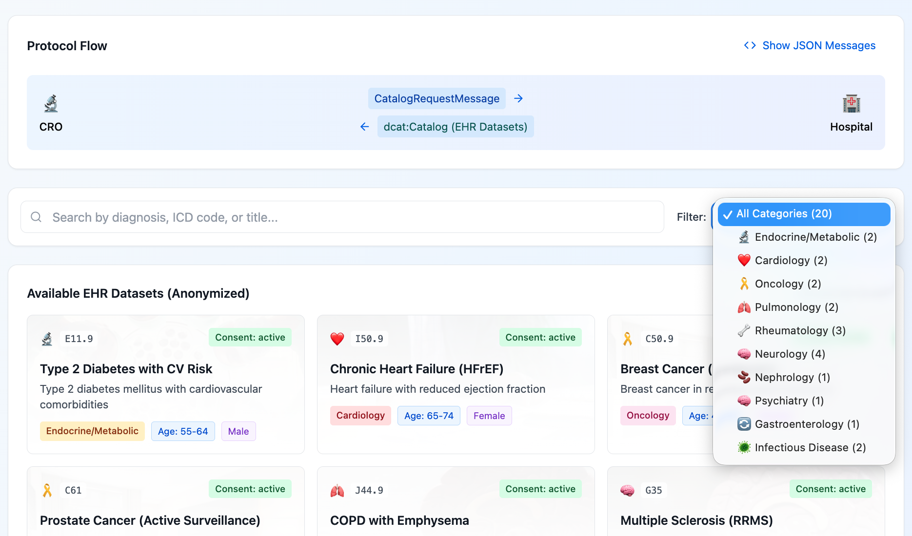

**Key Features:**
- Search by diagnosis, ICD code, or MedDRA terms
- Filter by medical category (Cardiology, Oncology, etc.)
- Filter by clinical trial phase (Phase I-IV)
- EU CTR 536/2014 compliance metadata

### Step 2: Contract Negotiation

Secure consent verification and contract negotiation following DSP state machine:


**DSP States Visualized:**
- REQUESTING → OFFERED → ACCEPTING → AGREED → FINALIZED

### Step 3: Data Transfer

Secure data transfer with de-identification and provenance tracking:


**Transfer Features:**
- EDR (Endpoint Data Reference) token management
- Secure HTTPS data transfer
- De-identification pipeline execution
- Provenance credential generation

### Step 4: EHR Viewer

FHIR R4-compliant Electronic Health Record viewer with clinical trial metadata:


**Displayed Information:**
- Patient demographics (anonymized)
- Primary diagnosis with ICD-10 codes
- Clinical trial information (phase, protocol, endpoints)
- MedDRA v27.0 classification (SOC, Preferred Terms)
- Adverse Drug Reactions with causality assessment
- 5-step anamnesis (medical history)

### Docker Environment

Running the demo in Docker with full EDC infrastructure:


---

## Quick Reference

This section provides quick access to frequently used commands and endpoints. Keep this reference handy during development and troubleshooting. For detailed explanations, refer to the relevant chapters above.

### Common Commands

These are the most frequently used commands for building, running, and testing the system. Copy-paste them directly into your terminal.

```bash
# Build everything (requires persistence flag for Docker/Vault support)
./gradlew -Ppersistence=true build -x test

# Option A: Start local mock mode (ports 4000/4001)
cd backend-mock && npm run dev:local
cd frontend && npm run dev:local

# Option B: Start Docker EDC mode (ports 3000/3001/3002)
docker-compose -f docker-compose.health.yml -f docker-compose.edc.yml up

# Seed dataspace (Option B only)
./seed-dataspace.sh --mode=docker  # full seed (identity + health)

# Run all tests
./gradlew test && cd frontend && npm test
```

### Useful Endpoints

Bookmark these endpoints for quick access during development. Health endpoints return 200 OK when services are ready. API endpoints require appropriate authentication headers as documented in the API Reference chapter.

**Option A (Local Development):**

| Service | Health | API |
|---------|--------|-----|
| Frontend | http://localhost:4000 | - |
| Backend-Mock | http://localhost:4001/health | http://localhost:4001/api/ehr |

**Option B (Docker/EDC):**

| Service | Health | API |
|---------|--------|-----|
| Frontend | http://localhost:3000 | - |
| Backend-Mock | http://localhost:3001/health | http://localhost:3001/api/ehr |
| Backend-EDC | http://localhost:3002/health | http://localhost:3002/api/catalog |
| Consumer EDC | http://localhost:8081 | http://localhost:8081/api/management/v3 |
| Provider EDC | http://localhost:8191 | http://localhost:8191/api/management/v3 |
| Pact Broker | http://localhost:9292 | - |

---

*Last updated: December 2024*
