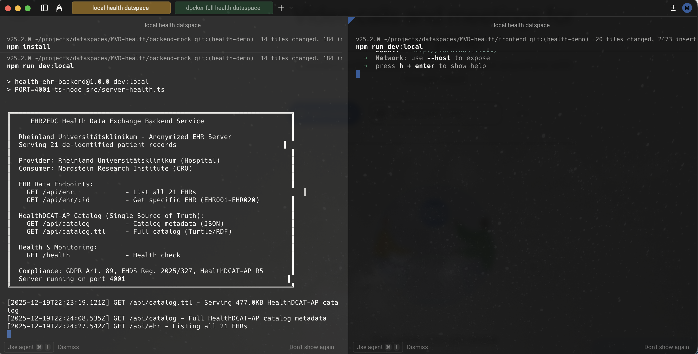
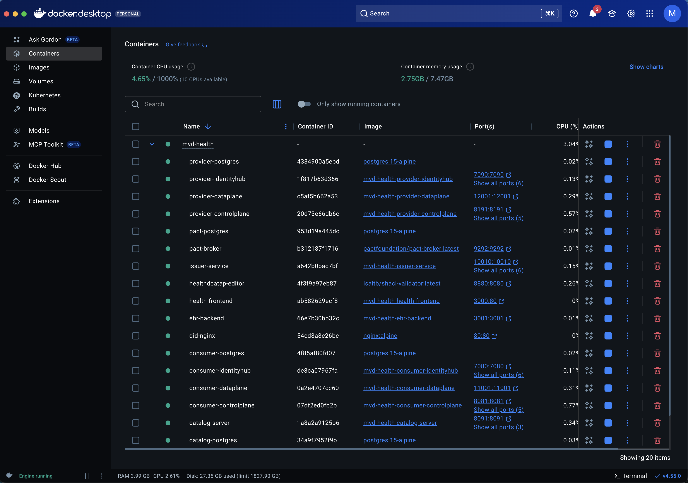
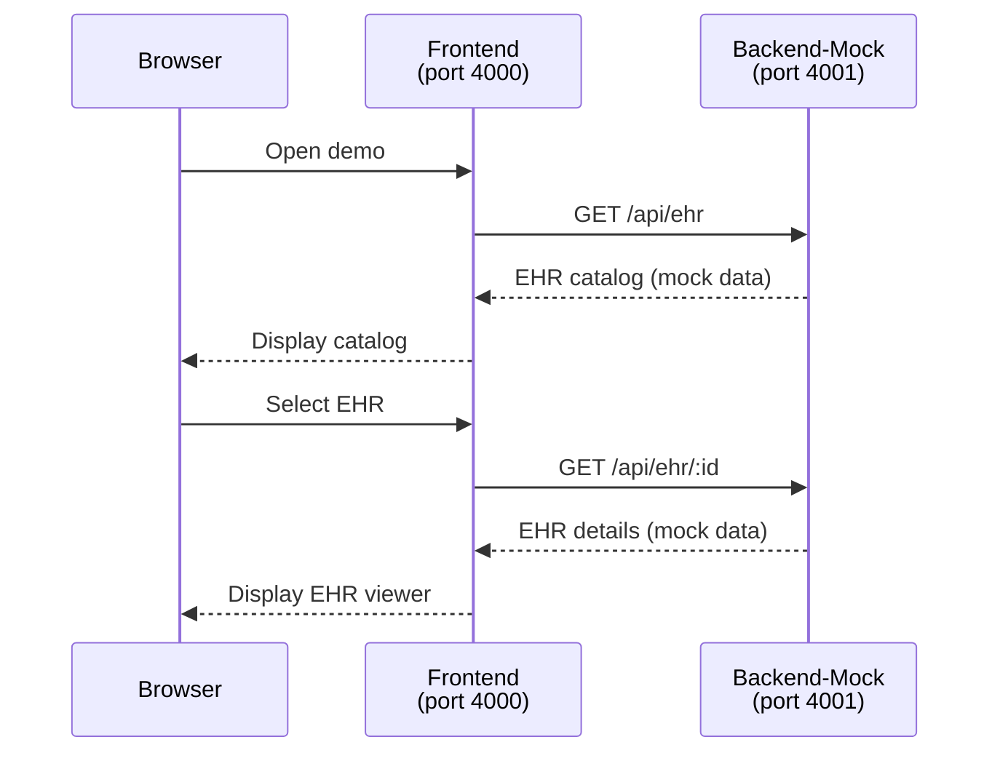
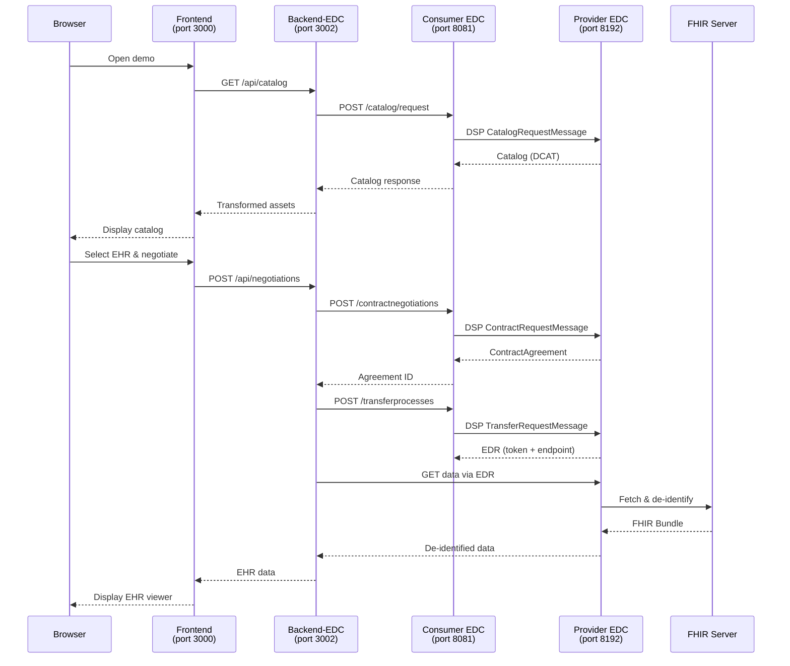

# EHR2EDC User Manual

A step-by-step guide for using the Health Dataspace Demo to securely exchange Electronic Health Records (EHR) with consent-gated access.

---

## Table of Contents

1. [Getting Started](#1-getting-started)
2. [Demo Modes](#2-demo-modes)
3. [Step-by-Step Demo Walkthrough](#3-step-by-step-demo-walkthrough)
4. [Understanding the Data Flow](#4-understanding-the-data-flow)
5. [Observability & Monitoring](#5-observability--monitoring)
6. [Troubleshooting](#6-troubleshooting)

---

## 1. Getting Started

### Prerequisites

- Modern web browser (Chrome, Firefox, Edge, Safari)
- Docker Desktop (for full EDC mode)
- Node.js 18+ (for local development)

### Quick Start

Both options can run **simultaneously** on different ports:
- **Option A**: Ports 4000 (frontend) and 4001 (backend)
- **Option B**: Ports 3000 (frontend), 3001 (backend-mock), 3002 (backend-edc)

#### Option A: Mock Mode (fast frontend development - No Docker Required)

Local development using ports 4000/4001, which don't conflict with Docker.

```bash
# Terminal 1: Start the mock backend on port 4001
cd backend-mock
npm install
npm run dev:local

# Terminal 2: Start the frontend on port 4000
cd frontend
npm install
npm run dev:local
```

Mock Mode (fast frontend development) in local setup

Open http://localhost:4000 in your browser.

#### Option B: Full EDC Mode (Complete Dataspace)

Docker-based deployment using ports 3000/3001/3002.

```bash
# Build Java components (requires persistence flag for Docker/Vault support)
./gradlew -Ppersistence=true build -x test

# Start all services
docker-compose -f docker-compose.health.yml -f docker-compose.edc.yml up --build

# In another terminal, seed the dataspace

We provide a unified, cross-platform seeding script that works on macOS and Linux and supports multiple modes (`local`, `docker`, `k8s`):

```bash
# Full seeding (identity + health assets) for Docker
./seed-dataspace.sh --mode=docker

# Skip parts if required
./seed-dataspace.sh --mode=docker --skip-identity    # skip identity/participant seeding
./seed-dataspace.sh --mode=docker --skip-health      # skip health asset seeding

# Local (IntelliJ) mode
./seed-dataspace.sh --mode=local

# Verbose output for troubleshooting
./seed-dataspace.sh --mode=docker --verbose
```

Notes:
- The script handles PEM conversion in a way that's compatible with macOS and Linux (no GNU sed dependency).
- It also regenerates tokens for existing participants (idempotent behavior) and stores secrets in the connector vaults.
- Legacy wrappers remain: `./seed.sh` and `./seed-docker.sh` (kept for backward compatibility).
```

Full EDC Mode (Complete Dataspace) in Docker

Open http://localhost:3000 in your browser.

---

## 2. Demo Modes

The application supports three operational modes:

| Mode | Backend Port | Frontend Port | Description | Use Case |
|------|-------------|---------------|-------------|----------|
| **Mock (Local)** | 4001 | 4000 | Direct access to simulated EHR data | Quick demos, local development |
| **Mock (Docker)** | 3001 | 3000 | Direct access via Docker | Container testing |
| **Hybrid** | 3002 | 3000 | EDC catalog + mock data | Testing EDC integration |
| **Full** | 3002 | 3000 | Complete EDC data flow | Production-like testing |

### How to Switch Modes

The mode is controlled via environment variables in the frontend:

```bash
# For local development (Option A - ports 4000/4001)
# Uses .env.standalone automatically via --mode standalone
npm run dev:local

# For Docker modes (Option B - ports 3000/3001/3002)
cp frontend/.env.mock frontend/.env.local    # For mock mode via Docker
cp frontend/.env.hybrid frontend/.env.local  # For hybrid mode
cp frontend/.env.full frontend/.env.local    # For full mode
npm run dev
```

The **Mode Indicator** in the header shows the current mode:
- 🗄️ **Mock** (gray) - Using simulated data
- ☁️ **Hybrid** (blue) - EDC catalog with mock data
- 🔧 **Full EDC** (indigo) - Complete dataspace flow

---

## 3. Step-by-Step Demo Walkthrough

### Step 1: Launch the Demo

1. Open http://localhost:3000
2. You'll see the landing page with the demo title "Health Dataspace - EHR2EDC Demo"
3. Check the **Backend Status** indicator (top right):
   - 🟢 Green = Backend connected
   - 🟡 Yellow = Using mock data fallback
   - 🔴 Red = Connection error

4. Click **"Start Demo"** to begin

### Step 2: Browse the EHR Catalog

The catalog displays available Electronic Health Records as cards.

#### Filtering Options

| Filter | Description | Examples |
|--------|-------------|----------|
| **Medical Category** | Clinical specialty | Cardiology, Oncology, Neurology |
| **Age Band** | Patient age range | 18-24, 35-44, 65+ |
| **Clinical Phase** | Study phase | Phase I, Phase II, Phase III |
| **MedDRA SOC** | System Organ Class | Cardiac disorders, Neoplasms |
| **Search** | Free-text search | "diabetes", "I10", "Phase III" |

#### Advanced Filters (EU CTR 536/2014)

Click "Show Advanced Filters" to access:
- **Sponsor Type**: Commercial, Academic, Non-profit
- **Therapeutic Area**: EMA therapeutic classifications
- **Member States**: EU countries participating in trial

#### Reading EHR Cards

Each card displays:
- **EHR ID** and **Diagnosis** with ICD-10-GM code
- **Age Band** and **Biological Sex**
- **MedDRA Classification** (SOC and Preferred Terms)
- **Clinical Trial Phase** (if applicable)
- **Consent Status** indicator
- **Sensitive Category** badge (for genomics/mental health)

### Step 3: Select an EHR Record

1. Click on an EHR card to select it
2. The card will highlight with a blue border
3. Click **"Request Consent Verification"** to proceed

> **Note**: Records with `genomics` or `mental-health` sensitivity require Confidential Compute and will show an additional step.

### Step 4: Contract Negotiation (DSP Protocol)

The system now performs Dataspace Protocol contract negotiation:

```
Step 1/5: Consumer requests catalog from Provider
Step 2/5: Provider returns catalog with available datasets
Step 3/5: Consumer selects offer and initiates negotiation
Step 4/5: Provider verifies credentials and consent
Step 5/5: Contract agreement finalized
```

Watch the progress indicator as each step completes (animated in ~5 seconds).

**What's happening behind the scenes:**
- Consumer's EDC sends `ContractRequestMessage` to Provider
- Provider's IdentityHub verifies `MembershipCredential` and `ConsentCredential`
- ODRL policies are evaluated against credentials
- If policies pass, `ContractAgreement` is signed

### Step 5: Data Transfer

After successful negotiation, data transfer begins:

```
Step 1/4: Transfer process initiated
Step 2/4: Provider prepares de-identified data
Step 3/4: Data transferred via EDR endpoint
Step 4/4: Transfer completed successfully
```

**In Full EDC mode**, the actual transfer uses:
- Endpoint Data Reference (EDR) token
- Authenticated HTTP-PULL transfer
- De-identification pipeline on provider side

### Step 6: Confidential Compute (If Required)

For sensitive data (genomics, mental health), an additional step appears:

```
Step 1/4: Initializing Trusted Execution Environment (TEE)
Step 2/4: Attestation verification in progress
Step 3/4: Executing analysis in secure enclave
Step 4/4: Encrypted results ready for download
```

This simulates "Data Visiting" where:
- Data never leaves the provider's secure environment
- Only aggregated/encrypted results are returned
- Patient-level data remains protected

### Step 7: View Electronic Health Record

After successful transfer, the EHR Viewer displays:

#### Patient Demographics
- Basic demographics (anonymized in demo)
- Vital signs (height, weight, blood pressure, heart rate)

#### Diagnosis Information
- Primary diagnosis with ICD-10-GM code
- Additional conditions and comorbidities

#### Clinical Trial Information
- **Phase**: Phase I-IV with descriptions
- **Protocol ID**: Study protocol identifier
- **Study Name**: Full study title
- **Endpoints**: Primary and secondary endpoints

#### MedDRA Classification (v27.0)
- **System Organ Class (SOC)**: High-level body system
- **Preferred Terms (PT)**: Specific medical conditions

#### Signal Verification
- **Active Signals**: Safety signal status
- **ADR Count**: Number of Adverse Drug Reactions

#### Adverse Drug Reactions (ADRs)
Table showing:
| Term | Severity | Relatedness | Causality | Outcome |
|------|----------|-------------|-----------|---------|
| Event name | mild/moderate/severe | related/unrelated | Assessment | resolved/ongoing |

#### Anamnesis (Medical History)
5-step structured history:
1. **Chief Complaint**: Primary reason for visit
2. **History of Present Illness (HPI)**: Current condition details
3. **Past Medical History (PMH)**: Previous conditions
4. **Family History**: Relevant genetic/hereditary factors
5. **Social History**: Lifestyle factors

#### Raw FHIR Data
Click **"Show FHIR JSON"** to view the raw FHIR R4 Bundle with:
- Patient resource
- Condition resources
- Observation resources (vital signs)
- Medication resources

### Step 8: Download HealthDCAT-AP

Click **"Download HealthDCAT-AP"** to export:
- DCAT-AP for Health compliant metadata
- Turtle (TTL) format
- Machine-readable dataset description

### Step 9: Reset Demo

Click **"Reset Demo"** to return to the beginning and try another record.

---

## 4. Understanding the Data Flow

### Mock Mode Flow (Option A: Local)



### Full EDC Mode Flow (Option B: Docker)



---

## 5. Observability & Monitoring

The Health Dataspace includes a complete observability stack for monitoring, tracing, and debugging.

### Starting the Observability Stack

```bash
# Start observability tools alongside the health stack
docker-compose -f docker-compose.health.yml -f docker-compose.observability.yml up -d
```

### Observability Tools

| Tool | URL | Credentials | Purpose |
|------|-----|-------------|---------|
| **Grafana** | http://localhost:3003 | admin / dataspace | Dashboards & visualization |
| **Prometheus** | http://localhost:9090 | - | Metrics collection |
| **Jaeger** | http://localhost:16686 | - | Distributed tracing |
| **Loki** | http://localhost:3100 | - | Log aggregation |
| **Alertmanager** | http://localhost:9093 | - | Alert routing |

### Grafana Dashboards

Pre-built dashboards are available at http://localhost:3003:


*Health Dataspace Overview dashboard showing request rates, latencies, and error rates*

| Dashboard | Purpose |
|-----------|---------|
| **Health Dataspace Overview** | High-level system health and KPIs |
| **EDC Operations** | Negotiation and transfer metrics |
| **Data Transfer** | Transfer throughput and latencies |
| **Consent Management** | Consent verification statistics |
| **Compliance Audit** | EHDS compliance tracking |

### Prometheus Metrics

View raw metrics at http://localhost:9090. Key metrics:


*Prometheus showing catalog request rates and negotiation success rates*

- `http_requests_total` - Total HTTP requests by endpoint
- `negotiations_total` - Contract negotiations by status
- `transfers_total` - Data transfers by format
- `ehr_records_served_total` - EHR access count by category

### Jaeger Tracing

View distributed traces at http://localhost:16686:


*Jaeger showing a complete negotiation trace across services*

Traces show the full request path:
1. Frontend → Backend-EDC
2. Backend-EDC → Consumer Control Plane
3. Consumer → Provider (DSP protocol)
4. Provider → EHR Backend (data fetch)

### Loki Logs

Access logs via Grafana's Explore view:


*Loki log aggregation showing correlated logs across services*

Query logs by service:
```logql
{job="backend-edc"} |= "negotiation"
{job="ehr-backend"} |= "EHR-"
```

---

## 6. Troubleshooting

### Common Issues

#### Backend Not Connecting

**Symptom**: Yellow status indicator, "Using mock data fallback"

**Solutions**:
1. Check if backend is running:
   - **Option A (local)**: `curl http://localhost:4001/health`
   - **Option B (Docker)**: `curl http://localhost:3001/health` or `curl http://localhost:3002/health`
2. Verify Docker containers: `docker-compose -f docker-compose.health.yml ps`
3. Ensure you're using the correct `.env.local` file for your setup

#### EDC Services Not Starting

**Symptom**: Error 502 on catalog requests

**Solutions**:
1. Check EDC logs: `docker-compose -f docker-compose.edc.yml logs -f consumer-controlplane`
2. Wait for all services to be healthy (can take 30-60 seconds)
3. Seed the dataspace using the unified seeding script:
   ```bash
   ./seed-dataspace.sh --mode=docker
   # or skip parts:
   ./seed-dataspace.sh --mode=docker --skip-identity
   ```

#### Empty Catalog

**Symptom**: No EHR cards displayed

**Solutions**:
1. Run `./seed-health.sh` to populate assets
2. Check provider assets: `curl -X POST http://localhost:8191/api/management/v3/assets/request -H "X-Api-Key: password" -H "Content-Type: application/json" -d '{"offset":0,"limit":10}'`

#### Negotiation Fails

**Symptom**: "Negotiation terminated" or timeout

**Solutions**:
1. Check provider policies: Ensure credentials match policy requirements
2. Verify Identity Hub has credentials
3. Check negotiation state: `curl http://localhost:8081/api/management/v3/contractnegotiations/{id} -H "X-Api-Key: password"`

#### CORS Errors

**Symptom**: Browser console shows CORS blocked

**Solutions**:
1. Ensure backend is running (handles CORS)
2. Check that ports match your mode:
   - **Option A**: Frontend 4000, Backend-Mock 4001
   - **Option B**: Frontend 3000, Backend-Mock 3001, Backend-EDC 3002
3. Use the correct `.env.local` file for your mode

### Getting Help

1. Check the [Developer Manual](DEVELOPER-MANUAL.md) for technical details
2. Review logs: `docker-compose logs -f`
3. Open an issue on GitHub with:
   - Mode you're using (mock/hybrid/full)
   - Steps to reproduce
   - Browser console output
   - Backend logs

---

## Quick Reference Card

| Action | Option A: Local Mock | Option B: Full EDC (Docker) |
|--------|----------------------|---------------------------|
| Start backend | `npm run dev:local` (port 4001) | `docker-compose up` |
| Start frontend | `npm run dev:local` (port 4000) | `npm run dev` (port 3000) |
| Check health | `curl localhost:4001/health` | `curl localhost:3002/health` |
| View catalog API | `localhost:4001/api/ehr` | `localhost:3002/api/catalog` |
| Seed data | Not required | `./seed-dataspace.sh --mode=docker` |
| View EDC dashboard | N/A | `localhost:8081/api/management/v3` |
| URL | http://localhost:4000 | http://localhost:3000 |

---

*Last updated: December 2024*
